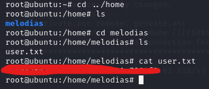

# [THM] Anonforce write-up

- IP: 10.10.148.129

## Recon

Sử dụng nmap để dò quét các cổng và dịch vụ đang mở
> nmap -sT -sV -sC -T4 10.10.148.129

<p align="center">
  
</p>

Có 3 port dịch vụ đang mở bao gồm
- Port 21 chạy dịch vụ FTP
- Port 22 chạy dịch vụ SSH
- Port 2033 đang được mở tuy nhiên có state filtered và sau khi check lại 1 lần nữa thì cổng này đã close ở lần dò quét thứ 2 

Ta nhận thấy có thể login FTP với Anonymous account, truy cập thành công vào FTP và nhận ra có thư mục bất thường `notread`


Phát hiện ra 2 file có vẻ đặc biệt


## Exploit

Sau khi tìm hiểu để giải mã file pgp thì trước hết ta cần import `private.asc` và decrypt `backup.pgp`
```sh
┌──(kali㉿kali)-[~]
└─$ gpg --import private.asc 
gpg: key B92CD1F280AD82C2: "anonforce <melodias@anonforce.nsa>" not changed
gpg: key B92CD1F280AD82C2: secret key imported
gpg: key B92CD1F280AD82C2: "anonforce <melodias@anonforce.nsa>" not changed
gpg: Total number processed: 2
gpg:              unchanged: 2
gpg:       secret keys read: 1
gpg:  secret keys unchanged: 1
                                                                                                                                                                                                                  
┌──(kali㉿kali)-[~]
└─$ gpg --decrypt backup.pgp
gpg: encrypted with 512-bit ELG key, ID AA6268D1E6612967, created 2019-08-12
      "anonforce <melodias@anonforce.nsa>"
gpg: public key decryption failed: Timeout
gpg: decryption failed: No secret key
```
Nhưng sau khi thực hiện hành động ta được yêu cầu nhập mật khẩu để có thể decrypt được backup.pgp


Vì vậy trước hết cần bẻ khóa `private.asc` bằng **John the Ripper** 
```sh
┌──(kali㉿kali)-[~]
└─$ gpg2john private.asc > hash

File private.asc
                                                                                                                                                                                                                  
┌──(kali㉿kali)-[~]
└─$ john --show hash           
anonforce:xbox360:::anonforce <melodias@anonforce.nsa>::private.asc

1 password hash cracked, 0 left
```

Sau khi tìm dược mật khẩu là xbox360 thì ta có thể decrypt được file `backup.pgp`


Khi đó ta có thể lấy được hash mật khẩu của **root** ta tiếp tục sử dụng **John the Ripper** để bẻ khóa


Sử dụng mật khẩu vừa tìm được thực hiện SSH

## user.txt


## root.txt

