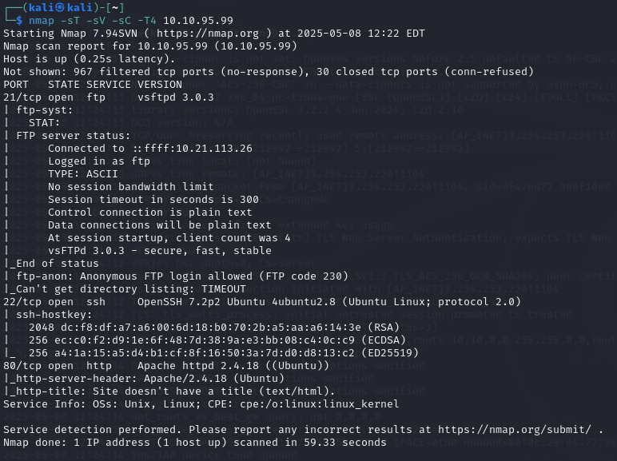
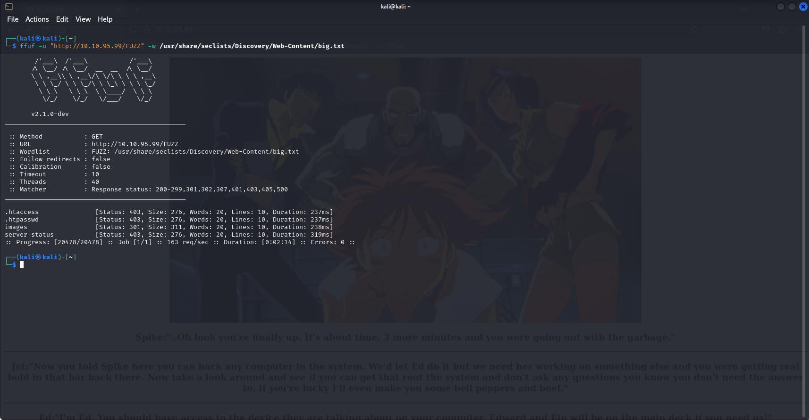
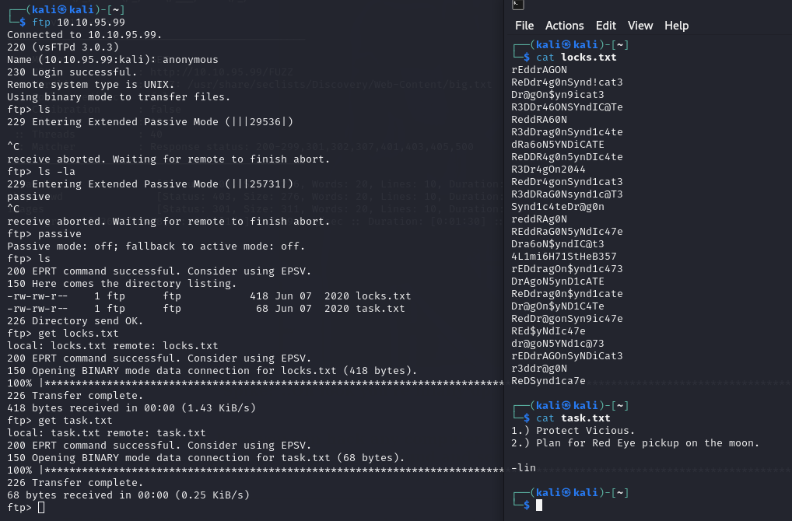
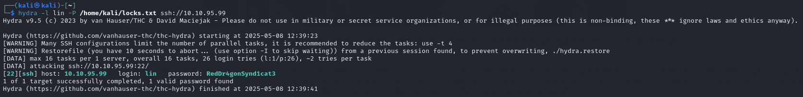
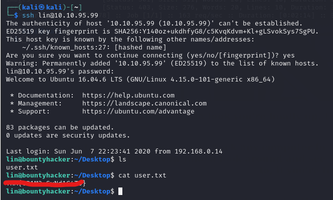
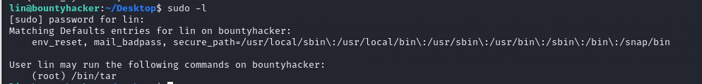
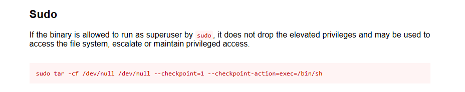
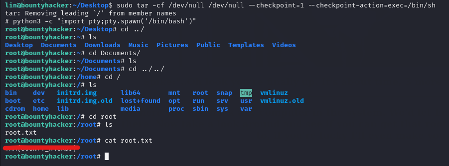

# [THM] Bounty Hacker write-up

- IP: 10.10.95.99

## Recon

Sử dụng nmap để dò quét các cổng và dịch vụ đang mở
> nmap -sT -sV -sC -T4 10.10.95.99



Có 3 port dịch vụ đang mở bao gồm
- Port 21 chạy dịch vụ FTP
- Port 22 chạy dịch vụ SSH
- Port 80 chạy dịch vụ HTTP 

Truy cập web có giao diện như dưới. Sau khi check source và scan ffuf thì ta thấy không thu thập được thông tin gì để tận dụng.



Ta nhận thấy `FTP` cho phép login với account **Anonymous** vậy ta sẽ thử xem có thông tin gì hữu ích không.



Ta nhận thấy trong file `task.txt` có thông tin user `lin` và file `locks.txt` chứa thông tin có vẻ như là mật khẩu. Vậy ta sẽ tận dụng nốt port 22 để truy cập xem sao.

## Exploit
Sử dụng công cụ `hydra` để bruteforce mật khẩu của user **lin**



Đúng là như vậy, đã tìm kiếm được thông tin để có thể truy cập `SSH`

## user.txt
Sau khi truy cập `SSH` với user `lin` ta đã lấy được flag ở file `user.txt`



## Privilege escalation
Ta có thể thấy với user `lin` có quyền root để thực hiện `/bin/tar`. Tìm kiếm và nhận thấy có thể leo thang đặc quyền tham khảo [GTFOBins](https://gtfobins.github.io/gtfobins/tar/)





```sh
sudo tar -cf /dev/null /dev/null --checkpoint=1 --checkpoint-action=exec=/bin/sh
```

## root.txt
Sau khi leo thang đặc quyền lên `root` ta đã tìm thấy được root flag trong file `root.txt`




