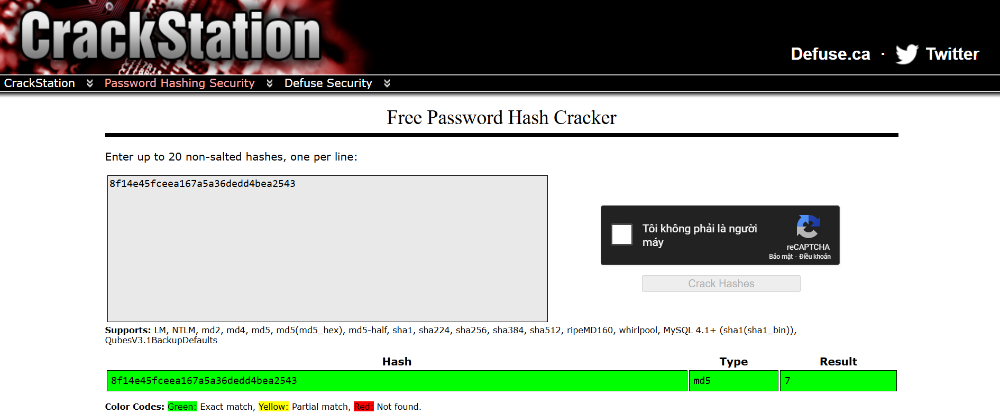

# [THM] Corridor write-up

- IP: 10.10.179.149

## Recon

Sử dụng nmap để dò quét các cổng và dịch vụ đang mở
> nmap -sT -sV -sC -T4 10.10.179.149

  

Có 1 port dịch vụ đang mở 
- Port 80 chạy dịch vụ http

Sau khi scan nmap có mỗi cổng dịch vụ 80 mở và kết hợp với dữ kiện đầu bài cho đó là khám phá lỗ hổng `IDOR` tiềm ẩn trong trang web. Với đó là các giá trị thập lục phân (có thể đoán được là hàm băm)

**Giao diện trang web**

  

Sau khi kiểm tra source code thì đúng như dữ kiện đầu bài cho ta đã có được một số chuỗi có vẻ như hàm băm

  

Đó là link khi ta bấm vào cánh cửa ta sẽ được redirect tới đường dẫn như hình bên dưới

  

Ta sẽ thử phân tích mã này trên [Cyberchef](https://gchq.github.io/CyberChef/)

  

Với kết quả trên ta sẽ thử giải mã `MD5` với công cụ [Crackstation].(https://crackstation.net/)

  

Ta sẽ check bất kì cánh cửa nào khác xem sao, với kết quả như dưới ta có thể thấy được đây là các mã hash từ 1 tới 13

  

## Exploit
Với lỗ hổng `IDOR` thì ta có thể truy cập được các đường dẫn mà người dùng hiện tại không được phép truy cập. Với những điều mà ta đã tìm ra thì có thể chèn payload là các số thứ tự đã được băm với `MD5`

- Sử dụng công cụ `burp intruder` để gửi payload từ 1-20 mà ta đã băm

  

  

## Flag
Với payload `cfcd208495d565ef66e7dff9f98764da` là băm md5 của 0 ta đã nhận được flag

  

**DONE**
