# [THM] Ignite write-up

## Recon
Sử dụng nmap để dò quét các cổng và dịch vụ đang mở
> nmap -p- -T5 --max-retries=1 --min-rate=1000 injectics.thm

> nmap -p21,22,80,111,2049,35601,44777,46395,58545 -sV -sC injectics.thm

    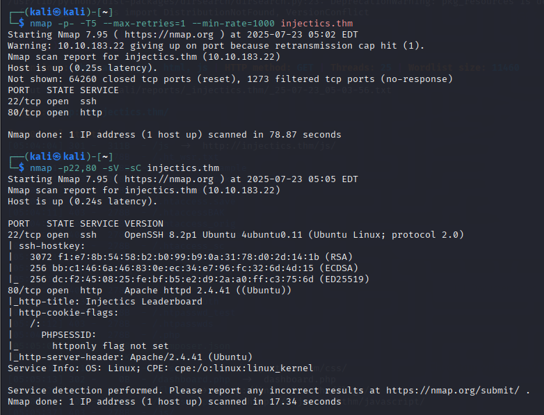

Các port dịch vụ đang mở bao gồm
- Port 22 chạy dịch vụ SSH
- Port 80 chạy dịch vụ HTTP

Truy cập port 80 có giao diện web như hình bên dưới

    

Sử dụng dirsearch scan thư mục ẩn và được kết quả như sau

    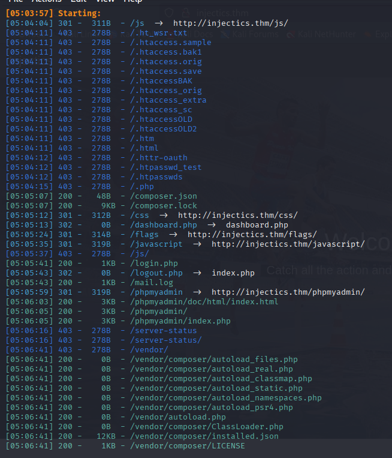

Một số đường dẫn ta cần quan tâm là `/composer.json`, `/composer.lock`, `/login.php`, `/mail.log`, `/phpmyadmin`

Lần lượt kiểm tra từng đường dẫn nhận thấy file 2 file `composer.json` và `composer.lock` chứa phiên bản của template hiện tại đang sử dụng đó là **Twig 2.14.0**

    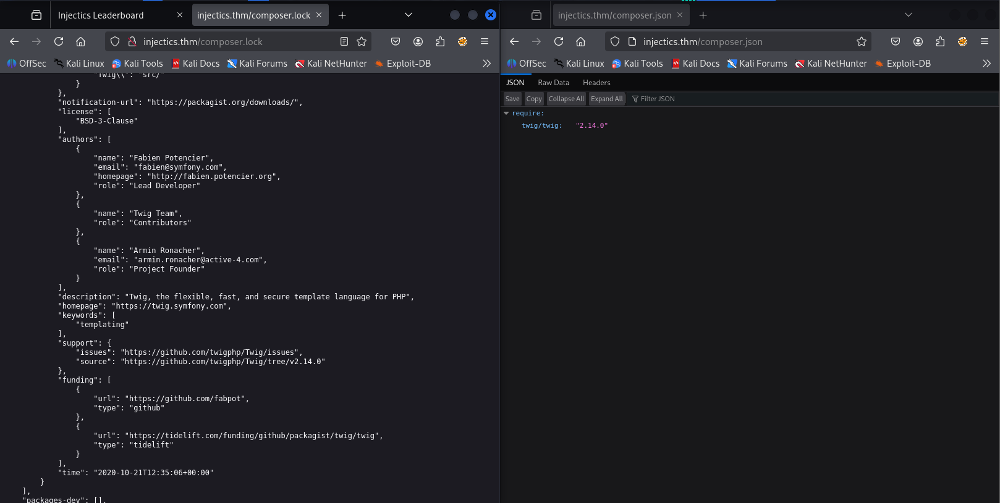

Tiếp theo là tới `/mail.log` có một số thông tin quan trọng đó là username và password của dev và admin, đọc note thì ta có thể thấy 1 lịch trình đã được tạo để insert vào bảng users tài khoản superadmin và dev khi mà nó bị xóa hay bị ngắt quãng hoạt động để đảm bảo truy cập. Nên tôi đã thử đăng nhập với 2 tài khoản trên nhưng hiện tại chưa đăng nhập được

    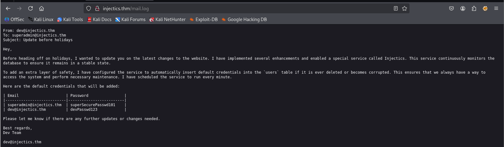

Đường dẫn `/login.php` sẽ dẫn ta tới trang đăng nhập, tại đây có 2 chức năng đăng nhập khác nhau dành cho dev và cho admin, admin sẽ đăng nhập theo đường dẫn `/adminLogin007.php`. Trước tiên sẽ thử một vài lỗ hổng phổ biến với trường đăng nhập của dev. Sử dụng Burp intruder kết hợp với [payload list](https://github.com/payloadbox/sql-injection-payload-list/blob/master/Intruder/exploit/Auth_Bypass.txt?source=post_page-----7de449371457---------------------------------------) để thử bypass

## Exploit

    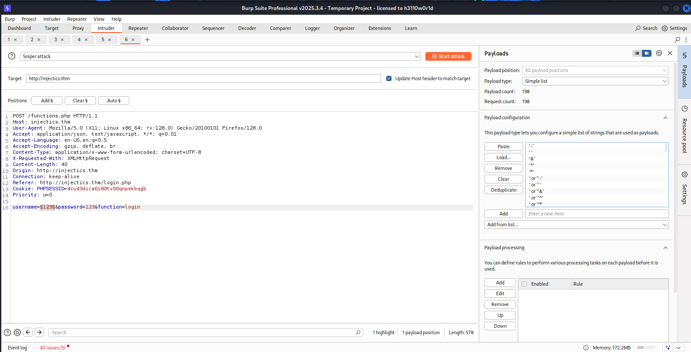

Đã tìm ra payload có thể bypass thành công đó là `' OR 'x'='x'#;`

    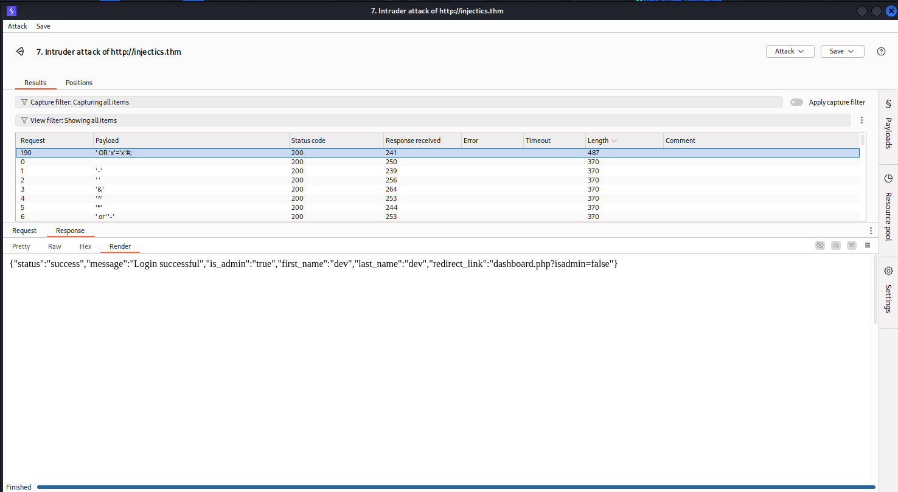

Quay trở lại với trang login và dùng payload trên để bypass nhưng lại nhận được thông báo như hình dưới và không thể đăng nhập 

    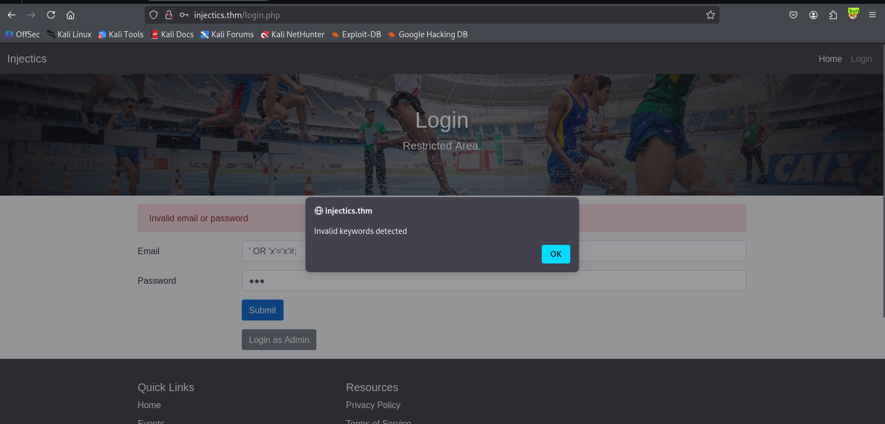

Sau một hồi tìm kiếm thì phát hiện ra file `script.js` được gọi tới để validate những ký tự đầu vào, những ký tự không được phép đó là `['or', 'and', 'union', 'select', '"', "'"]`

    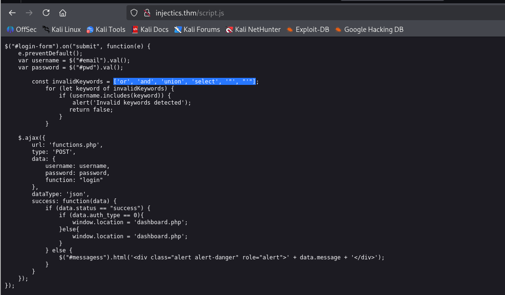

Ta cần encode payload để có thể pass qua `%27%20OR%20%27x%27%3d%27x%27%23%3b`. Khi và dashboard đã truy cập thành công vào dashboard

    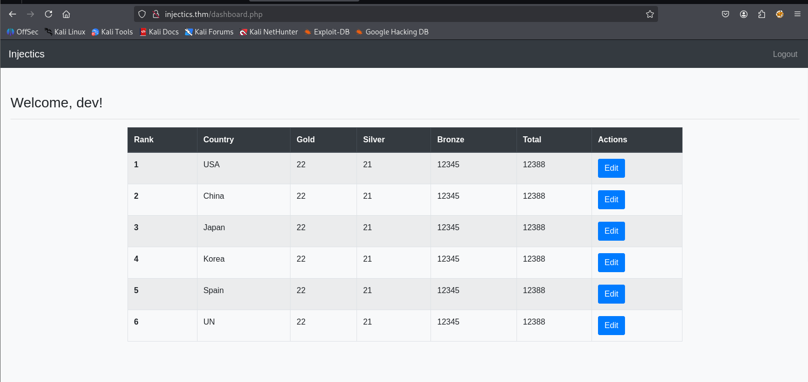

Test tại đường dẫn `/edit_leaderboard.php` với payload `'select 1;` thì báo lỗi thử thêm payload `; select 1;` đã thành công và redirect về dashboard

    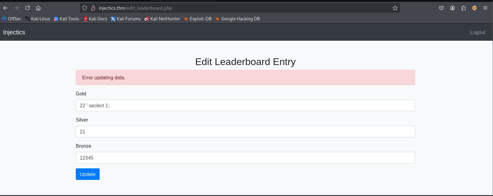

Ta có thể tận dụng lỗ hổng SQLi `;Drop table users;` để xóa bảng users, kết hợp với dữ kiện ở file mail.log. Khi xóa bảng users thì cronjob sẽ tự động insert tài khoản admin và dev vào bảng users

    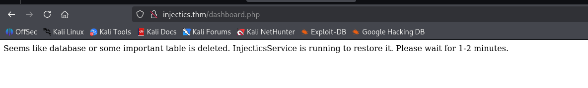

Sau khi xóa thì thông báo như trên, giờ ta có thể sử dụng tài khoản ở file mail.log để đăng nhập admin

Truy cập thành công và lấy được flag đầu tiên

    

Tiếp tục khám phá thấy chức năng update profile và còn 1 dữ kiện nữa ta chưa sử dụng đó là web này được build trên Twig version 2.14.0 là 1 template của PHP có thể bị tấn công SSTI

Đúng là như vậy khi gửi tên và submit là {{7*7}} kết quả hiện lên là 49

    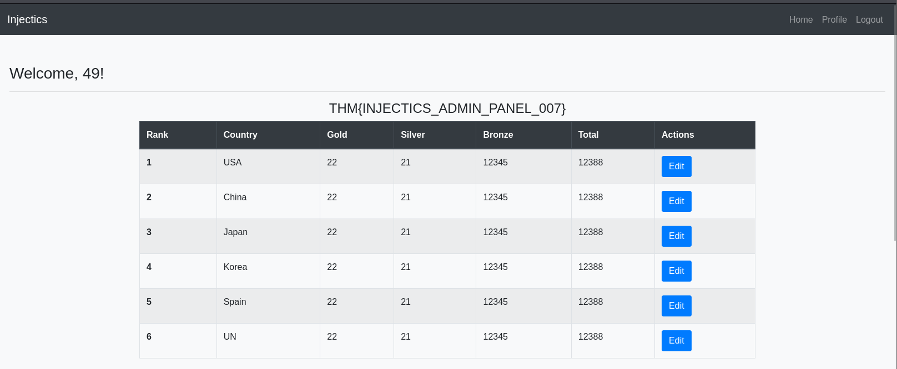

Tìm kiếm thông tin thì có thể sử dụng payload `{{ ["id",""]|sort('system') }}` để khai thác, tham khảo [tại đây](https://github.com/4rtamis/CVE-2022-23614)

    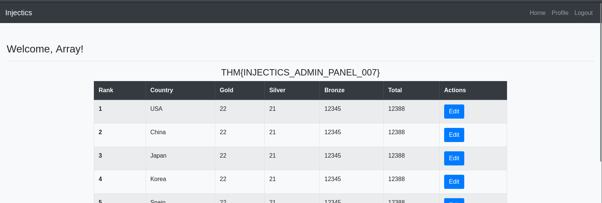

Nhưng khi sử dụng payload đó thì nó chưa hiển thị rõ thông tin, tìm kiếm thêm trong PHP còn một số hàm để chạy lệnh hệ thống `exec(),passthru()...`. Thử thì thấy `passthru()` hoạt động

    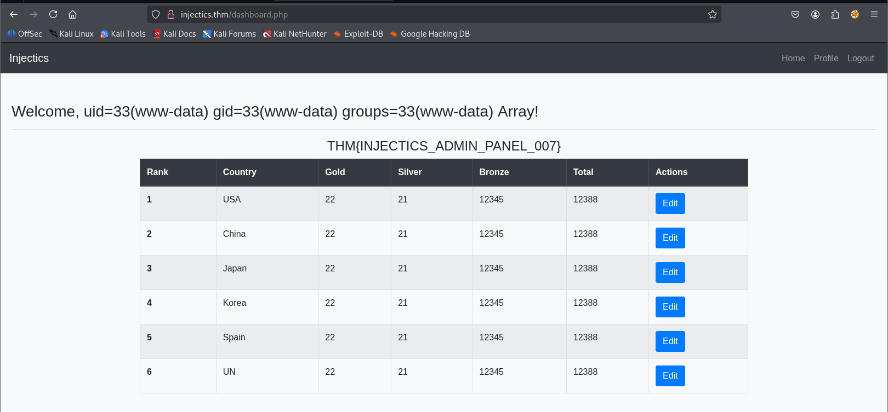

> {{ ["ls -la",""]|sort('passthru') }}

    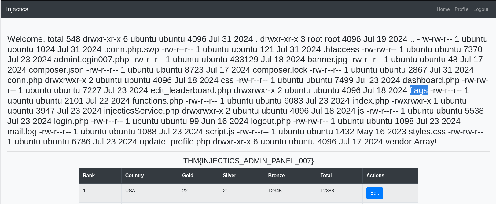

> {{ ["ls -la flags",""]|sort('passthru') }}

    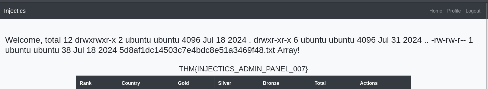

> {{ ["cat flags/5d8af1dc14503c7e4bdc8e51a3469f48.txt",""]|sort('passthru') }}

    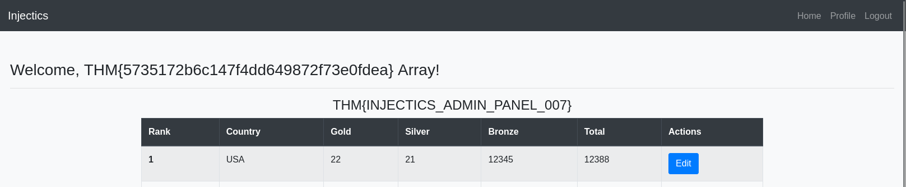

## DONE

    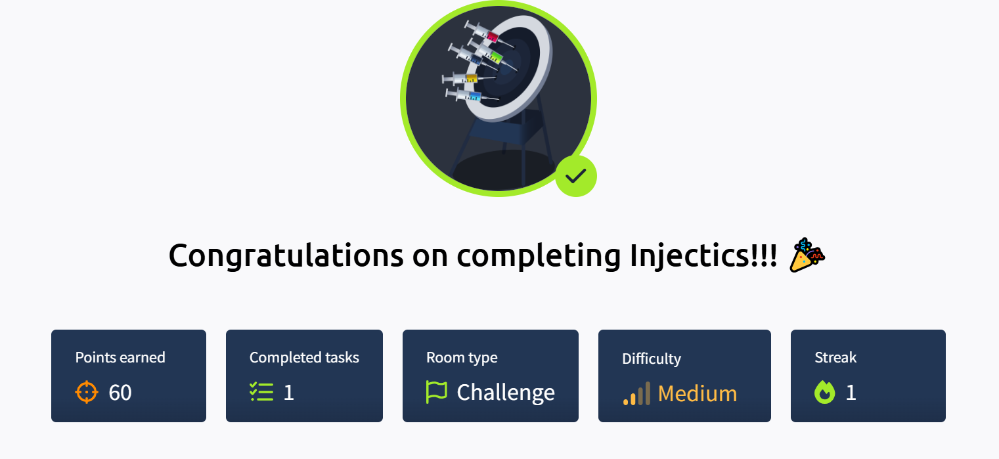

