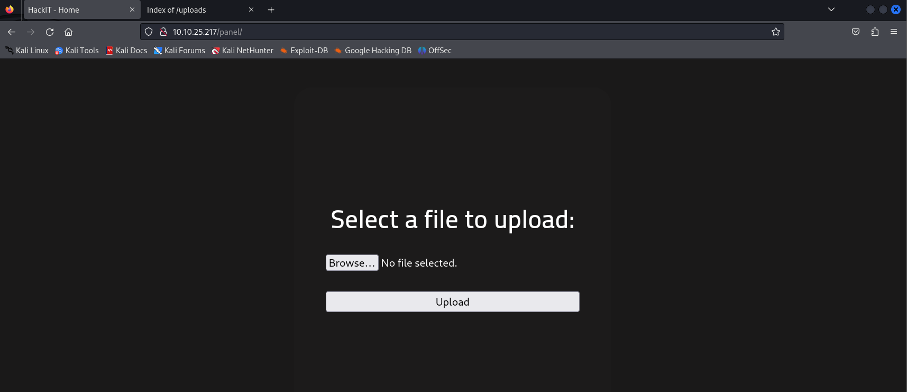
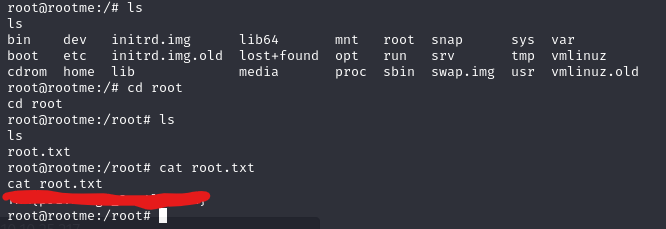

# [THM] RootMe write-up

- IP: 10.10.25.217

## Recon

Sử dụng nmap để dò quét các cổng và dịch vụ đang mở
> nmap -sT -sV -sC -T4 10.10.25.217

Có 2 port đang mở bao gồm
- Port 22 chạy dịch vụ SSH
- Port 80 chạy dịch vụ HTTP với Apache version 2.4.29

Giao diện web khi truy cập địa chỉ IP với port 80

Tiếp theo thực hiện tìm kiếm các thư mục ẩn với công cụ ffuf
> ffuf -u "http://10.10.25.217/FUZZ" -w /usr/share/seclists/Discovery/Web-Content/big.txt

 

Với kết quả trên nhận thấy có thư mục `/panel` và `/uploads` ta cùng khám phá 2 thư mục đó nhé!

Bên trên lần lượt là giao diện của 2 thư mục ẩn ta đã tìm kiếm được. Nhìn qua có vẻ ta cũng đã đoán được khi mà ta upload file gì đó ở `panel` nó sẽ được lưu trên server ở thư mục `uploads`. Tiếp theo sẽ thử upload file reverse shell lên xem nó có hoạt động không.

Khi upload file có đuôi `.php` thì ta đã nhận được thông báo như dưới, vậy là đã bị validate để ngăn chặn upload file php. Ngoài file `php` có thể nghĩ ngay tới định dang file khác đó là `phtml` nó cũng có thể thực thi được mã nguồn

Và đây là khi upload file có đuôi `.phtml` đã có thể upload thành công, nội dung file shell bên dưới

Kiểm tra trong thư mục `uploads` đã thấy file `shell.phtml` 

Tạo `Netcat listener` và truy cập file shell. Khi đó đã có thể truy cập với user `www-data`

## user.txt
Sau khi get thành công shell ta có thể lấy được user flag trong file user.txt

## Privilege Escalation
Bây giờ chúng ta đến với phần leo thang đặc quyền. Trước hết cần kiểm tra xem user hiện tại có được phép thực hiện câu lệnh nào với quyền sudo mà không cần mật khẩu không
> sudo -l

Không thể check được user có được thực hiện tác vụ gì không vậy nên tiếp theo ta sẽ kiểm tra tìm kiếm các tập tin có quyền **SUID** xem tập tin nào có thể tận dụng để leo thang đặc quyền
> find / -perm -4000 -type f 2>/dev/null

Ta có thể tận dụng được `python` với SUID để leo thang đặc quyền tham khảo [GTFOBINS](http://gtfobins.github.io/gtfobins/python/)

Đã thành công leo thang đặc quyền với câu lệnh
> python -c 'import os; os.setuid(0); os.system("/bin/bash")'

## root.txt
Tìm kiếm và lấy flag trong file root.txt

