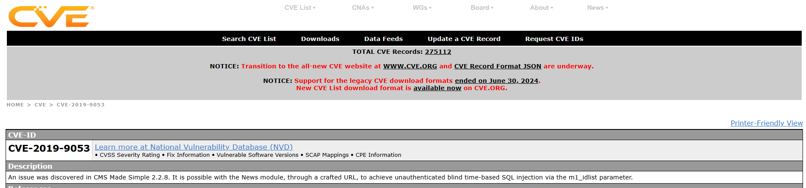

# [THM] Simple CTF write-up

- IP: 10.10.113.86

## Recon

Sử dụng nmap để dò quét các cổng và dịch vụ đang mở
> nmap -sT -sV -sC -T4 10.10.113.86

Có 3 port dịch vụ đang mở bao gồm
- Port 21 chạy dịch vụ FTP
- Port 80 chạy dịch vụ HTTP 
- Port 2222 chạy dịch vụ SSH

Ta nhận thấy rằng port 21 với dịch vụ FTP cho phép người dùng kết nối ẩn danh (Anonymous FTP Account) thử khám phá xem có gì không nào
Sau khi kết nối FTP và phát hiện ra file `ForMitch.txt` và đã kiểm tra file đó

Dường như thông tin trên không có gì quá hữu ích tiếp đến ta sẽ khám phá tới port 80
Đây là giao diện khi truy cập website và đó là default page của apache2 vậy thì ta sẽ tìm kiếm xem nó còn có thư mục ẩn nào không

Sau khi scan bằng công cụ ffuf 
> ffuf -u "http://10.10.113.86/FUZZ" -w /usr/share/seclists/Discovery/Web-Content/big.txt

Ta nhận được kết quả là có file ẩn `robots.txt` và thư mục ẩn `/simple`

Giao diện khi truy cập `/simple` đây là một giao diện của cms 

Sau khi thấy rằng đây là giao diện của cms để chắc chắn hơn và tìm kiếm version đang dùng ta kiểm tra bằng câu lệnh
> whatweb http://10.10.113.86/simple

Hiện tại trang web đang dùng CMS-Made-Simple[2.2.8] vậy liên kết với dữ kiện ở file `ForMitch.txt` ta có thể tìm được CVE khai thác lỗ hổng

Sau khi đã tìm kiếm và nhận thấy ở phiên bản này cms bị mắc lỗi SQL injection ta có thể khai thác thông qua CVE-2019-9053 

Tìm kiếm PoC và chạy câu lệnh để scan tài khoản mật khẩu
> python exploit.py -u http://10.10.113.86/simple -w /home/kali/Desktop/rockyou.txt

Sau khi chạy lệnh sẽ tìm kiếm được account mà còn port 2222 chúng ta chưa sử dụng 

Đăng nhập ssh bằng account trên ta đã vào được shell của user

## User.txt

## Privilege Escalation